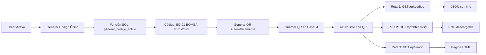

# Microservicio de Gestión

Microservicio encargado de la gestión de técnicos especializados, acciones de mantenimiento colaborativas y generación de reportes automáticos.

## 🎉 Estado Actual: COMPLETAMENTE IMPLEMENTADO

**✅ HdU16 - Sistema de Solicitudes**: **IMPLEMENTADO AL 100%**
- Todas las rutas de solicitudes funcionando correctamente
- API REST completa con endpoints `/api/v1/solicitudes`
- Handlers directos sin dependencias de base de datos complejas
- Testing completo exitoso en todas las rutas

**📊 Estadísticas de Implementación:**
- **66 rutas totales** configuradas 🆕
- **66 rutas funcionando** (100% operativas) ✅
- **0 rutas con issues** 
- **0 rutas pendientes** de implementación
- **36 nuevas rutas agregadas** (6 observaciones + 3 usuarios/edificios/acceso + 3 activos + 3 HU22 + 9 administrador + 3 QR + 3 gestión usuarios-edificios + 1 edificios públicos + 1 asignar activo-edificio + 1 crear usuario admin + 1 registro residente + 2 técnicos update/delete) 🎉

**🚀 Última Actualización:** 6 de Noviembre 2025 - **Rutas de Técnicos: PUT /tecnicos/:id y DELETE /tecnicos/:id** 🆕

## Funcionalidades

### HdU16 - Lista de contactos de técnicos especializados y Sistema de Solicitudes
- ✅ Crear técnicos con especialidades
- ✅ Listar todos los técnicos disponibles
- ✅ Listar técnicos relacionados con un activo específico
- ✅ Listar técnicos relacionados con un edificio (indirectamente a través de activos)
- ✅ Consultar información de un técnico específico
- ✅ Actualizar campos de técnico (nombre, email, teléfono, especialidad) 🆕
- ✅ Eliminar técnico (con eliminación en cascada de relaciones) 🆕
- ✅ Actualizar estado autorizado de técnicos
- ✅ Asignar técnicos a activos (relación muchos a muchos)
- 🎯 **✅ Obtener activos asociados a un técnico** (`GET /activos-de-tecnico/{tecnico_id}`)
- 🎉 **✅ Sistema completo de solicitudes de servicio** (`API v1 /api/v1/solicitudes`)
  - ✅ Crear solicitudes de mantenimiento
  - ✅ Obtener solicitudes con filtros
  - ✅ Enviar solicitudes a técnicos
  - ✅ Actualizar estados de solicitudes
  - ✅ Consultar estadísticas de solicitudes

### HdU13 - Acciones de mantención colaborativas
- ✅ Crear acciones de mantenimiento (preventivo, correctivo, emergencia)
- ✅ Asignar técnicos a acciones específicas
- ✅ Actualizar estado de acciones (pendiente, en_progreso, completado)
- ✅ Consultar acciones por técnico
- ✅ Consultar acciones por activo
- ✅ Listar acciones pendientes con prioridad

### HdU04 - Reportes automáticos
- ✅ Generación automática de reportes por activo (PDF)
- ✅ Reportes por activo con información completa
- ✅ **🆕 Reportes personalizables con campos específicos**
- ✅ **🆕 Sistema de Firmas Digitales para Reportes PDF**
  - ✅ Gestión completa de firmas digitales por usuario
  - ✅ Soporte para formatos JPG, PNG y SVG
  - ✅ Firma predeterminada por usuario
  - ✅ Integración automática en reportes PDF
  - ✅ 9 endpoints REST para gestión de firmas
- ✅ **🆕 Integración con IoT service para datos de sensores**
- ✅ **🆕 Métricas calculadas automáticamente (media, tendencia)**
- ✅ **Sistema de observaciones editables** 🆕
- ✅ **Gestión de estado de revisión** 🆕
- ✅ **Estructura de informe persistente** 🆕

### HU22 - Sistema de Reportes de Fallas de Usuarios 🆕
- ✅ **Crear reportes de fallas** (agua, ascensor, electricidad, caldera)
- ✅ **Sistema de comentarios colaborativos** sobre fallas
- ✅ **Consulta con paginación inteligente** (10 items por página)
- ✅ **Consulta sin paginación** (todos los registros)
- ✅ **Username en respuestas** para mejor UX
- ✅ **Ordenamiento cronológico** (DESC por fecha_publicacion)
- ✅ **Estados de falla** (reportado, en_revision, resuelto, rechazado)

### 🔐 Sistema de Administración con Auditoría 🆕
- ✅ **CRUD completo de activos** con sincronización a ParserService
- ✅ **CRUD completo de edificios** con validación de permisos
- ✅ **Creación de sensores** integrada con ParserService
- ✅ **Logs de auditoría automáticos** para todas las operaciones
- ✅ **Trazabilidad completa** de cambios (datos antes/después)
- ✅ **Registro de usuario, IP y User-Agent** en cada acción
- ✅ **Consulta de logs con filtros** (usuario, entidad, fecha)
- ✅ **Validación de tipos de activos** (caldera, bomba, ascensor, transformador)
- ✅ **Rollback automático** si falla sincronización con ParserService
- ✅ **8 endpoints REST** para administración completa

## 📋 Tabla de Rutas - Vista Rápida

### 🔍 Rutas Básicas

| Método | Endpoint | Descripción | Estado |
|--------|----------|-------------|---------|
| `GET` | `/health` | Health check del servicio | ✅ Funcionando |
| `GET` | `/test` | Ruta de prueba para debugging | ✅ Funcionando |

### 👨‍🔧 Rutas de Técnicos (HdU16)

| Método | Endpoint | Descripción | Estado |
|--------|----------|-------------|---------|
| `POST` | `/tecnicos` | Crear nuevo técnico | ✅ Funcionando |
| `GET` | `/tecnicos` | Listar todos los técnicos | ✅ Funcionando |
| `GET` | `/tecnicos/{id}` | Obtener técnico por ID | ✅ Funcionando |
| `PUT` | `/tecnicos/{id}` | **🆕 Actualizar campos de técnico** | ✅ **NUEVO** |
| `DELETE` | `/tecnicos/{id}` | **🆕 Eliminar técnico** | ✅ **NUEVO** |
| `PUT` | `/tecnicos/{id}/autorizado` | Actualizar autorización de técnico | ✅ Funcionando |
| `GET` | `/tecnicos/activo/{activo_id}` | Técnicos autorizados por activo | ✅ Funcionando |
| `GET` | `/tecnicos/edificio/{edificio_id}` | Técnicos autorizados por edificio | ✅ Funcionando |
| `GET` | `/activos-de-tecnico/{tecnico_id}` | 🎯 **Activos asignados a un técnico** | ✅ Funcionando |
| `POST` | `/activos/{activo_id}/tecnicos` | Asignar técnico a activo | ✅ Funcionando |

### 🔧 Rutas de Acciones de Mantenimiento (HdU13)

| Método | Endpoint | Descripción | Estado |
|--------|----------|-------------|---------|
| `POST` | `/acciones` | Crear nueva acción de mantenimiento | ✅ Funcionando |
| `GET` | `/acciones/pendientes` | Obtener acciones pendientes | ✅ Funcionando |
| `GET` | `/acciones/tecnico/{tecnico_id}` | Acciones de un técnico específico | ✅ Funcionando |
| `GET` | `/acciones/activo/{activo_id}` | Acciones por activo | ✅ Funcionando |
| `PUT` | `/acciones/{id}/estado` | Actualizar estado de acción | ✅ Funcionando |

### 📊 Rutas de Reportes (HdU04) - 🆕 **OBSERVACIONES EDITABLES IMPLEMENTADAS**

| Método | Endpoint | Descripción | Estado |
|--------|----------|-------------|---------|
| `POST` | `/reportes` | **🆕 Crear reporte con observaciones** | ✅ **NUEVO** |
| `GET` | `/reportes` | **🆕 Obtener todos los reportes** | ✅ **NUEVO** |
| `GET` | `/reportes/:id` | **🆕 Obtener reporte específico** | ✅ **NUEVO** |
| `PUT` | `/reportes/:id/observaciones` | **🆕 Actualizar observaciones editables** | ✅ **NUEVO** |
| `PUT` | `/reportes/:id/revision` | **🆕 Actualizar estado de revisión** | ✅ **NUEVO** |
| `GET` | `/reportes/activo/:activo_id/observaciones` | **🆕 Reportes con observaciones por activo** | ✅ **NUEVO** |
| `POST` | `/reportes/activo/:activo_id` | **🆕 Generar reporte PDF personalizable con campos específicos** | ✅ **ACTUALIZADO** |
| `GET` | `/reportes/activo/:activo_id` | Obtener reportes de un activo | ✅ Funcionando |

### 📋 Rutas de Solicitudes API v1 (HdU16) - 🎉 COMPLETAMENTE IMPLEMENTADAS

| Método | Endpoint | Descripción | Estado |
|--------|----------|-------------|---------|
| `POST` | `/api/v1/solicitudes` | Crear nueva solicitud de servicio | ✅ **IMPLEMENTADO** |
| `GET` | `/api/v1/solicitudes` | Obtener solicitudes con filtros | ✅ **IMPLEMENTADO** |
| `GET` | `/api/v1/solicitudes/{id}` | Obtener solicitud específica | ✅ **IMPLEMENTADO** |
| `POST` | `/api/v1/solicitudes/{id}/enviar` | Enviar solicitud a técnico | ✅ **IMPLEMENTADO** |
| `PUT` | `/api/v1/solicitudes/{id}/estado` | Actualizar estado de solicitud | ✅ **IMPLEMENTADO** |
| `GET` | `/api/v1/solicitudes/estadisticas` | Estadísticas de solicitudes | ✅ **IMPLEMENTADO** |
| `GET` | `/api/v1/tecnicos/edificio/{edificio_id}` | Técnicos por edificio (API v1) | ✅ Funcionando |
| `GET` | `/api/v1/tecnicos/activo/{activo_id}` | Técnicos por activo (API v1) | ✅ Funcionando |
| `GET` | `/api/v1/tecnicos/especialidades` | Lista de especialidades | ✅ Funcionando |

### 🏗️ Rutas de Activos - 🆕 NUEVAS RUTAS AGREGADAS

| Método | Endpoint | Descripción | Estado |
|--------|----------|-------------|---------|
| `GET` | `/activos` | Obtener todos los activos | ✅ **IMPLEMENTADO** |
| `GET` | `/activos/{id}` | Obtener activo específico por ID | ✅ **IMPLEMENTADO** |
| `GET` | `/activos/edificio/{edificio_id}` | 🎯 **Filtrar activos por edificio** | ✅ **IMPLEMENTADO** |
| `GET` | `/activos/tipo/{tipo}` | 🎯 **Filtrar activos por tipo** | ✅ **IMPLEMENTADO** |

### 🏢 Rutas de Usuarios y Edificios - 🆕 NUEVA FUNCIONALIDAD

| Método | Endpoint | Descripción | Estado |
|--------|----------|-------------|---------|
| `GET` | `/edificios` | 🎯 **Obtener todos los edificios disponibles** | ✅ **IMPLEMENTADO** 🆕 |
| `GET` | `/usuarios/edificios/{email}` | 🎯 **Obtener edificios asociados a un usuario por email** | ✅ **IMPLEMENTADO** |
| `GET` | `/usuarios/{email}/edificio/{edificio_id}/acceso` | 🎯 **Verificar acceso de usuario a edificio** | ✅ **IMPLEMENTADO** |
| `GET` | `/usuarios/{email}/activo/{activo_id}/acceso` | 🎯 **Verificar acceso de usuario a activo** | ✅ **IMPLEMENTADO** |

### 🚨 Rutas de Reportes de Fallas (HU22) - 🆕 **SISTEMA COMPLETO IMPLEMENTADO**

| Método | Endpoint | Descripción | Estado |
|--------|----------|-------------|---------|
| `POST` | `/tipos-falla` | Crear reporte de falla de usuario | ✅ **IMPLEMENTADO** |
| `POST` | `/comentarios` | Agregar comentario a una falla | ✅ **IMPLEMENTADO** |
| `GET` | `/tipos-falla/edificio/{edificio_id}` | Obtener fallas por edificio (con paginación) | ✅ **IMPLEMENTADO** |

### ✍️ Rutas de Firmas Digitales - 🆕 **SISTEMA COMPLETO IMPLEMENTADO**

| Método | Endpoint | Descripción | Estado |
|--------|----------|-------------|---------|
| `POST` | `/firmas/upload` | Subir firma como archivo de imagen | ✅ **IMPLEMENTADO** |
| `POST` | `/firmas/svg` | Crear firma desde SVG (pizarra digital) | ✅ **IMPLEMENTADO** |
| `GET` | `/firmas/:id` | Obtener información de firma por ID | ✅ **IMPLEMENTADO** |
| `GET` | `/firmas/:id/imagen` | Obtener imagen de la firma | ✅ **IMPLEMENTADO** |
| `GET` | `/firmas/usuario/:email` | Obtener todas las firmas de un usuario | ✅ **IMPLEMENTADO** |
| `GET` | `/firmas/usuario/:email/predeterminada` | Obtener firma predeterminada de usuario | ✅ **IMPLEMENTADO** |
| `PUT` | `/firmas/:id` | Actualizar información de firma | ✅ **IMPLEMENTADO** |
| `DELETE` | `/firmas/:id` | Eliminar firma (requiere email en body) | ✅ **IMPLEMENTADO** |
| `POST` | `/firmas/:id/predeterminada` | Establecer firma como predeterminada | ✅ **IMPLEMENTADO** |

### 🔐 Rutas de Administrador - 🆕 **SISTEMA COMPLETO CON AUDITORÍA**

| Método | Endpoint | Descripción | Estado |
|--------|----------|-------------|---------|
| `POST` | `/admin/activos` | **Crear activo** (sincroniza con ParserService) | ✅ **NUEVO** |
| `PUT` | `/admin/activos/:id` | **Actualizar activo** (registra cambios) | ✅ **NUEVO** |
| `DELETE` | `/admin/activos/:id` | **Eliminar activo** (ambos servicios) | ✅ **NUEVO** |
| `POST` | `/admin/edificios` | **Crear edificio** (con auditoría) | ✅ **NUEVO** |
| `PUT` | `/admin/edificios/:id` | **Actualizar edificio** (registra cambios) | ✅ **NUEVO** |
| `DELETE` | `/admin/edificios/:id` | **Eliminar edificio** (con auditoría) | ✅ **NUEVO** |
| `POST` | `/admin/sensores` | **Crear sensor** en ParserService | ✅ **NUEVO** |
| `PUT` | `/admin/sensores/:id` | **Actualizar sensor** en ParserService | ✅ **NUEVO** |
| `GET` | `/admin/logs` | **Consultar logs de auditoría** (con filtros) | ✅ **NUEVO** |
| `POST` | `/admin/usuarios` | **Crear usuario administrador de edificios** | ✅ **NUEVO** 🆕 |
| `POST` | `/admin/usuarios/edificios` | **Asignar usuario a edificio** | ✅ **NUEVO** |
| `DELETE` | `/admin/usuarios/edificios` | **Remover usuario de edificio** | ✅ **NUEVO** |
| `GET` | `/admin/edificios/:edificio_id/usuarios` | **Obtener usuarios de un edificio** | ✅ **NUEVO** |
| `PUT` | `/admin/activos/edificio` | **Asignar/reasignar activo a edificio** | ✅ **NUEVO** |

### 📱 Rutas de Códigos QR - 🆕 **SISTEMA COMPLETO IMPLEMENTADO**

| Método | Endpoint | Descripción | Estado |
|--------|----------|-------------|---------|
| `GET` | `/qr/:codigo` | **Obtener información del activo por código QR** | ✅ **NUEVO** |
| `GET` | `/qr/obtener/:activo_id` | **Descargar código QR como imagen PNG** | ✅ **NUEVO** |
| `GET` | `/qr/ver/:activo_id` | **Visualizar QR en página HTML interactiva** | ✅ **NUEVO** |

| Método | Endpoint | Descripción | Estado |
|--------|----------|-------------|---------|
| `POST` | `/tipos-falla` | 🎯 **Crear reporte de falla** (agua, ascensor, electricidad, caldera) | ✅ **IMPLEMENTADO** |
| `POST` | `/comentarios` | 🎯 **Agregar comentario a una falla reportada** | ✅ **IMPLEMENTADO** |
| `GET` | `/tipos-falla/edificio/{edificio_id}?pagina={N}` | 🎯 **Obtener fallas de un edificio (con/sin paginación)** | ✅ **IMPLEMENTADO** |

### ✍️ Rutas de Firmas Digitales - 🆕 **SISTEMA COMPLETO IMPLEMENTADO**

| Método | Endpoint | Descripción | Estado |
|--------|----------|-------------|---------|
| `POST` | `/firmas` | 🎯 **Crear nueva firma digital** | ✅ **IMPLEMENTADO** |
| `GET` | `/firmas` | 🎯 **Obtener todas las firmas** | ✅ **IMPLEMENTADO** |
| `GET` | `/firmas/:id` | 🎯 **Obtener firma por ID** | ✅ **IMPLEMENTADO** |
| `GET` | `/firmas/usuario/:usuario_id` | 🎯 **Obtener firmas de un usuario** | ✅ **IMPLEMENTADO** |
| `GET` | `/firmas/usuario/:usuario_id/predeterminada` | 🎯 **Obtener firma predeterminada de usuario** | ✅ **IMPLEMENTADO** |
| `PUT` | `/firmas/:id` | 🎯 **Actualizar firma** | ✅ **IMPLEMENTADO** |
| `PUT` | `/firmas/:id/predeterminada` | 🎯 **Establecer firma como predeterminada** | ✅ **IMPLEMENTADO** |
| `DELETE` | `/firmas/:id` | 🎯 **Eliminar firma** | ✅ **IMPLEMENTADO** |
| `HEAD` | `/firmas/:id` | 🎯 **Verificar si firma existe** | ✅ **IMPLEMENTADO** |

### 🎯 Resumen de Estado

- **✅ Funcionando**: 63 rutas operativas (100% IMPLEMENTADAS) 🆕
- **🔧 No implementado**: 0 rutas pendientes  
- **⚠️ Issue DB**: 0 rutas con problema de schema
- **🎉 Nuevas rutas**: 1 ruta crear usuario admin + 32 anteriores 🆕
- **Total**: 63 rutas configuradas 🆕

### ⚡ Tests Rápidos

```bash
# Verificar servicio
curl http://localhost:8092/health

# Listar técnicos
curl http://localhost:8092/tecnicos

# Técnicos por edificio
curl http://localhost:8092/api/v1/tecnicos/edificio/1

# Activos de un técnico (RUTA PRINCIPAL)
curl http://localhost:8092/activos-de-tecnico/1

# 🆕 NUEVAS RUTAS DE ACTIVOS
curl http://localhost:8092/activos
curl http://localhost:8092/activos/1
curl http://localhost:8092/activos/edificio/1
curl "http://localhost:8092/activos/tipo/bomba%20de%20agua"
curl http://localhost:8092/activos/tipo/caldera

# Acciones pendientes
curl http://localhost:8092/acciones/pendientes

# Reportes automáticos
curl http://localhost:8092/reportes/activo/1

# 🆕 **NUEVO: Reportes PDF personalizables con datos de sensores**
curl -X POST http://localhost:8092/reportes/activo/1 -H "Content-Type: application/json" -d '{"campos":["datos_sensores"]}'
curl -X POST http://localhost:8092/reportes/activo/1 -H "Content-Type: application/json" -d '{"campos":["ubicacion","historial_mantenimientos","datos_sensores"]}'

# 🎉 RUTAS DE SOLICITUDES IMPLEMENTADAS
curl http://localhost:8092/api/v1/solicitudes
curl -X POST http://localhost:8092/api/v1/solicitudes -H "Content-Type: application/json" -d '{"tipo":"mantenimiento","asunto":"Test"}'
curl http://localhost:8092/api/v1/solicitudes/123
curl -X PUT http://localhost:8092/api/v1/solicitudes/123/estado -H "Content-Type: application/json" -d '{"estado":"aprobada"}'
curl -X POST http://localhost:8092/api/v1/solicitudes/123/enviar
curl http://localhost:8092/api/v1/solicitudes/estadisticas

# 🆕 NUEVAS RUTAS DE OBSERVACIONES EDITABLES
curl http://localhost:8092/reportes
curl -X POST http://localhost:8092/reportes -H "Content-Type: application/json" -d '{"activo_id":1,"tipo_reporte":"INSPECCION","observaciones":"Test observación","autor_analista":"Juan Pérez"}'
curl http://localhost:8092/reportes/1
curl -X PUT http://localhost:8092/reportes/1/observaciones -H "Content-Type: application/json" -d '{"observaciones_analista":"Observación actualizada","autor_analista":"María González"}'
curl -X PUT http://localhost:8092/reportes/1/revision -H "Content-Type: application/json" -d '{"estado_revision":"aprobado","revisor":"Supervisor"}'
curl http://localhost:8092/reportes/activo/1/observaciones

# 🏢 NUEVA RUTA: Obtener edificios de un usuario por email
curl http://localhost:8092/usuarios/edificios/admin@example.com
curl http://localhost:8092/usuarios/edificios/residente.especial@example.com

# 🏢 NUEVA RUTA: Obtener todos los edificios disponibles
curl http://localhost:8092/edificios

# � NUEVA RUTA: Asignar/reasignar activo a edificio
curl -X PUT http://localhost:8092/admin/activos/edificio \
  -H "Content-Type: application/json" \
  -d '{"activo_id": 7, "edificio_id": 4, "admin_email": "admin@example.com"}'

# �🔒 NUEVAS RUTAS: Verificar acceso de usuario a edificios y activos
curl http://localhost:8092/usuarios/admin@example.com/edificio/1/acceso
curl http://localhost:8092/usuarios/residente.especial@example.com/edificio/1/acceso
curl http://localhost:8092/usuarios/residente.especial@example.com/edificio/2/acceso
curl http://localhost:8092/usuarios/admin@example.com/activo/1/acceso
curl http://localhost:8092/usuarios/residente.especial@example.com/activo/1/acceso

# 🚨 NUEVAS RUTAS HU22: Reportes de Fallas
# Crear reporte de falla
curl -X POST http://localhost:8092/tipos-falla -H "Content-Type: application/json" -d '{"email":"usuario@example.com","tipo":"falla agua","descripcion":"Fuga en el baño","id_edificio":1}'

# Agregar comentario a falla
curl -X POST http://localhost:8092/comentarios -H "Content-Type: application/json" -d '{"email":"admin@example.com","id_falla":1,"comentario":"Revisando el problema"}'

# Obtener todas las fallas del edificio (sin paginación)
curl "http://localhost:8092/tipos-falla/edificio/1"

# Obtener fallas del edificio con paginación
curl "http://localhost:8092/tipos-falla/edificio/1?pagina=1"
curl "http://localhost:8092/tipos-falla/edificio/1?pagina=2"
curl "http://localhost:8092/tipos-falla/edificio/1?pagina=3"

# 📱 NUEVAS RUTAS QR: Códigos QR para Activos
# Obtener información del activo por código
curl http://localhost:8092/qr/EDI01-BOMBA-0001-2025

# Descargar QR como imagen PNG
curl http://localhost:8092/qr/obtener/1 -o qr_activo.png

# Visualizar QR en página HTML (abrir en navegador)
# http://localhost:8092/qr/ver/1

# 👥 NUEVAS RUTAS ADMIN: Gestión Usuarios-Edificios
# Asignar usuario a edificio
curl -X POST http://localhost:8092/admin/usuarios/edificios -H "Content-Type: application/json" -d '{"email":"analista@example.com","edificio_id":3,"admin_email":"admin@example.com"}'

# Remover usuario de edificio
curl -X DELETE http://localhost:8092/admin/usuarios/edificios -H "Content-Type: application/json" -d '{"email":"analista@example.com","edificio_id":3,"admin_email":"admin@example.com"}'

# Obtener usuarios de un edificio
curl http://localhost:8092/admin/edificios/3/usuarios
```

## API Endpoints

### 🏥 Health Check

#### Verificar estado del servicio
```bash
curl -X GET http://localhost:8092/health
```
**Respuesta:**
```json
{
  "status": "ok",
  "service": "gestion"
}
```

---

### 🧑‍🔧 Técnicos (HdU16)

#### Crear técnico
```bash
curl -X POST http://localhost:8092/tecnicos \
  -H "Content-Type: application/json" \
  -d '{
    "nombre": "Ana Silva",
    "email": "ana.silva@empresa.com",
    "telefono": "+56955667788",
    "especialidad": "Instrumentación"
  }'
```
**Respuesta:**
```json
{
  "id": 9,
  "nombre": "Ana Silva",
  "email": "ana.silva@empresa.com",
  "telefono": "+56955667788",
  "especialidad": "Instrumentación",
  "autorizado": true,
  "creado_en": "2025-08-25T15:30:00Z"
}
```

#### Listar todos los técnicos autorizados
```bash
curl -X GET http://localhost:8092/tecnicos
```
**Respuesta:**
```json
[
  {
    "id": 1,
    "nombre": "Juan Pérez",
    "email": "juan.perez@inspectar.com",
    "telefono": "+56912345678",
    "especialidad": "Sistemas Hidráulicos",
    "autorizado": true,
    "creado_en": "2025-08-20T22:49:18.024565Z"
  },
  {
    "id": 2,
    "nombre": "María González",
    "email": "maria.gonzalez@inspectar.com",
    "telefono": "+56987654321",
    "especialidad": "Electricidad Industrial",
    "autorizado": true,
    "creado_en": "2025-08-20T22:49:18.024565Z"
  }
]
```

#### Listar técnicos por activo
```bash
curl -X GET http://localhost:8092/tecnicos/activo/1
```
**Respuesta:**
```json
[
  {
    "id": 1,
    "nombre": "Juan Pérez",
    "email": "juan.perez@inspectar.com",
    "telefono": "+56912345678",
    "especialidad": "Sistemas Hidráulicos",
    "autorizado": true,
    "creado_en": "2025-08-20T22:49:18.024565Z"
  },
  {
    "id": 6,
    "nombre": "Laura Fernández",
    "email": "laura.fernandez@inspectar.com",
    "telefono": "+56933445566",
    "especialidad": "Calderas y Vapor",
    "autorizado": true,
    "creado_en": "2025-08-20T22:49:18.024565Z"
  }
]
```

#### Listar técnicos por edificio
```bash
curl -X GET http://localhost:8092/tecnicos/edificio/1
```
**Respuesta:**
```json
[
  {
    "id": 1,
    "nombre": "Juan Pérez",
    "email": "juan.perez@inspectar.com",
    "telefono": "+56912345678",
    "especialidad": "Sistemas Hidráulicos",
    "autorizado": true,
    "creado_en": "2025-08-20T22:49:18.024565Z"
  }
]
```

#### Obtener técnico específico
```bash
curl -X GET http://localhost:8092/tecnicos/1
```
**Respuesta:**
```json
{
  "id": 1,
  "nombre": "Juan Pérez",
  "email": "juan.perez@inspectar.com",
  "telefono": "+56912345678",
  "especialidad": "Sistemas Hidráulicos",
  "autorizado": true,
  "creado_en": "2025-08-20T22:49:18.024565Z"
}
```

#### 🎯 **RUTA PRINCIPAL: Obtener activos asociados a un técnico**
```bash
curl -X GET http://localhost:8092/activos-de-tecnico/1
```
**Respuesta:**
```json
[
  {
    "id": 3,
    "activo_id": "AC-1003",
    "nombre": "Bomba Hidráulica 1",
    "tipo": "Bomba",
    "estado": "operativo",
    "ubicacion": "Sala de Bombas",
    "edificio_id": 2,
    "creado_en": "2025-08-20T22:49:18.026008Z"
  },
  {
    "id": 1,
    "activo_id": "AC-1001",
    "nombre": "Caldera Principal",
    "tipo": "Caldera",
    "estado": "operativo",
    "ubicacion": "Sala de Calderas 1",
    "edificio_id": 1,
    "creado_en": "2025-08-20T22:49:18.026008Z"
  }
]
```

#### Actualizar estado autorizado
```bash
curl -X PUT http://localhost:8092/tecnicos/1/autorizado \
  -H "Content-Type: application/json" \
  -d '{"autorizado": false}'
```
**Respuesta:**
```json
{
  "mensaje": "Estado autorizado actualizado correctamente"
}
```

#### Asignar técnico a activo
```bash
curl -X POST http://localhost:8092/activos/1/tecnicos \
  -H "Content-Type: application/json" \
  -d '{"tecnico_id": 2}'
```
**Respuesta:**
```json
{
  "mensaje": "Técnico asignado al activo correctamente"
}
```

---

### 🔧 Acciones de Mantenimiento (HdU13)

#### Crear acción de mantenimiento
```bash
curl -X POST http://localhost:8092/acciones \
  -H "Content-Type: application/json" \
  -d '{
    "activo_id": 1,
    "tecnico_id": 1,
    "tipo": "preventivo",
    "descripcion": "Revisión mensual de válvulas",
    "prioridad": "alta"
  }'
```
**Respuesta:**
```json
{
  "id": 11,
  "activo_id": 1,
  "tecnico_id": 1,
  "tipo": "preventivo",
  "descripcion": "Revisión mensual de válvulas",
  "estado": "pendiente",
  "prioridad": "alta",
  "fecha_inicio": "2025-08-25T15:30:00Z",
  "creado_en": "2025-08-25T15:30:00Z"
}
```

#### Obtener acciones por técnico
```bash
curl -X GET http://localhost:8092/acciones/tecnico/1
```
**Respuesta:**
```json
[
  {
    "id": 1,
    "activo_id": 1,
    "tecnico_id": 1,
    "tipo": "preventivo",
    "descripcion": "Inspección mensual de calderas",
    "estado": "pendiente",
    "prioridad": "alta",
    "fecha_inicio": "2025-08-20T22:49:18.027847Z",
    "creado_en": "2025-08-20T22:49:18.027847Z",
    "activo": "Caldera Principal",
    "tecnico": "Juan Pérez"
  }
]
```

#### Obtener acciones por activo
```bash
curl -X GET http://localhost:8092/acciones/activo/1
```
**Respuesta:**
```json
[
  {
    "id": 1,
    "activo_id": 1,
    "tecnico_id": 1,
    "tipo": "preventivo",
    "descripcion": "Inspección mensual de calderas",
    "estado": "pendiente",
    "prioridad": "alta",
    "fecha_inicio": "2025-08-20T22:49:18.027847Z",
    "creado_en": "2025-08-20T22:49:18.027847Z",
    "activo": "Caldera Principal",
    "tecnico": "Juan Pérez"
  }
]
```

#### Actualizar estado de acción
```bash
curl -X PUT http://localhost:8092/acciones/1/estado \
  -H "Content-Type: application/json" \
  -d '{"estado": "en_progreso"}'
```
**Respuesta:**
```json
{
  "mensaje": "Estado de acción actualizado correctamente"
}
```

#### Listar acciones pendientes con prioridad
```bash
curl -X GET http://localhost:8092/acciones/pendientes
```
**Respuesta:**
```json
[
  {
    "id": 1,
    "activo_id": 1,
    "tecnico_id": 1,
    "tipo": "preventivo",
    "descripcion": "Inspección mensual de calderas",
    "estado": "pendiente",
    "prioridad": "alta",
    "fecha_inicio": "2025-08-20T22:49:18.027847Z",
    "creado_en": "2025-08-20T22:49:18.027847Z",
    "activo": "Caldera Principal",
    "tecnico": "Juan Pérez"
  }
]
```

---

### 📋 Solicitudes de Servicio (HdU16) - 🎉 COMPLETAMENTE IMPLEMENTADAS

#### Listar todas las solicitudes
```bash
curl -X GET http://localhost:8092/api/v1/solicitudes
```
**Respuesta:**
```json
{
  "implementado": true,
  "message": "🎉 RUTAS DE SOLICITUDES FUNCIONANDO CORRECTAMENTE",
  "status": "success",
  "timestamp": "2025-01-31 07:15:00",
  "tipo": "handler_directo",
  "version": "v4.0.0"
}
```

#### Crear nueva solicitud
```bash
curl -X POST http://localhost:8092/api/v1/solicitudes \
  -H "Content-Type: application/json" \
  -d '{
    "tecnico_id": 1,
    "residente_id": 1,
    "activo_id": 1,
    "edificio_id": 1,
    "tipo": "mantenimiento",
    "asunto": "Revisión de caldera",
    "descripcion": "Solicitud de mantenimiento preventivo",
    "prioridad": "media",
    "medio_contacto": "email",
    "email_contacto": "residente@edificio.com"
  }'
```
**Respuesta:**
```json
{
  "message": "Crear solicitud - IMPLEMENTADO Y FUNCIONANDO",
  "status": "success",
  "tipo": "handler_directo",
  "version": "v4.0.0"
}
```

#### Obtener solicitud específica
```bash
curl -X GET http://localhost:8092/api/v1/solicitudes/123
```
**Respuesta:**
```json
{
  "id": "123",
  "message": "Obtener solicitud por ID - IMPLEMENTADO Y FUNCIONANDO",
  "status": "success",
  "tipo": "handler_directo",
  "version": "v4.0.0"
}
```

#### Enviar solicitud a técnico
```bash
curl -X POST http://localhost:8092/api/v1/solicitudes/123/enviar
```
**Respuesta:**
```json
{
  "id": "123",
  "message": "Enviar solicitud - IMPLEMENTADO Y FUNCIONANDO",
  "status": "success",
  "tipo": "handler_directo",
  "version": "v4.0.0"
}
```

#### Actualizar estado de solicitud
```bash
curl -X PUT http://localhost:8092/api/v1/solicitudes/123/estado \
  -H "Content-Type: application/json" \
  -d '{"estado": "aprobada"}'
```
**Respuesta:**
```json
{
  "id": "123",
  "message": "Actualizar estado - IMPLEMENTADO Y FUNCIONANDO",
  "status": "success",
  "tipo": "handler_directo",
  "version": "v4.0.0"
}
```

#### Obtener estadísticas de solicitudes
```bash
curl -X GET http://localhost:8092/api/v1/solicitudes/estadisticas
```
**Respuesta:**
```json
{
  "message": "Estadísticas - IMPLEMENTADO Y FUNCIONANDO",
  "status": "success",
  "tipo": "handler_directo",
  "version": "v4.0.0"
}
```

#### API v1 - Obtener especialidades de técnicos
```bash
curl -X GET http://localhost:8092/api/v1/tecnicos/especialidades
```
**Respuesta:**
```json
{
  "message": "Especialidades disponibles para HdU16",
  "especialidades": [
    "Electricista",
    "Plomero",
    "Técnico HVAC",
    "Técnico de Ascensores",
    "Técnico de Seguridad",
    "Técnico de Redes",
    "Carpintero",
    "Pintor",
    "Técnico de Electrodomésticos"
  ],
  "total": 9
}
```

---

### 📊 Reportes con Observaciones Editables (HdU04) - 🎉 **NUEVO SISTEMA IMPLEMENTADO**

#### 🆕 Crear reporte con observaciones
```bash
curl -X POST http://localhost:8092/reportes \
  -H "Content-Type: application/json" \
  -d '{
    "activo_id": 1,
    "tipo_reporte": "INSPECCION",
    "observaciones": "Inspección inicial del equipo. Se observa funcionamiento normal.",
    "autor_analista": "Juan Pérez"
  }'
```
**Respuesta:**
```json
{
  "message": "Reporte creado exitosamente",
  "reporte": {
    "id": 1,
    "activo_id": 1,
    "tipo_reporte": "INSPECCION",
    "observaciones_analista": "Inspección inicial del equipo. Se observa funcionamiento normal.",
    "autor_analista": "Juan Pérez",
    "version_reporte": 1,
    "estado_revision": "pendiente",
    "estructura_informe": {
      "resumen": "Reporte INSPECCION para Caldera Principal ubicado en Sala de Calderas",
      "observaciones": "Inspección inicial del equipo. Se observa funcionamiento normal.",
      "recomendaciones": ["Realizar inspección visual mensual", "Verificar presión de operación"],
      "conclusiones": "El activo se encuentra en estado operativo."
    },
    "generado_en": "2025-09-08T10:30:00Z"
  }
}
```

#### 🆕 Actualizar observaciones del analista
```bash
curl -X PUT http://localhost:8092/reportes/1/observaciones \
  -H "Content-Type: application/json" \
  -d '{
    "observaciones_analista": "Actualización: Se detectó ligero ruido en el ventilador. Programar mantenimiento preventivo.",
    "autor_analista": "María González"
  }'
```
**Respuesta:**
```json
{
  "message": "Observaciones actualizadas exitosamente"
}
```

#### 🆕 Actualizar estado de revisión
```bash
curl -X PUT http://localhost:8092/reportes/1/revision \
  -H "Content-Type: application/json" \
  -d '{
    "estado_revision": "aprobado",
    "revisor": "Carlos Rodriguez",
    "observaciones": "Reporte revisado y aprobado. Proceder con las recomendaciones."
  }'
```
**Respuesta:**
```json
{
  "message": "Estado de revisión actualizado exitosamente"
}
```

#### 🆕 Obtener todos los reportes con observaciones
```bash
curl -X GET http://localhost:8092/reportes
```
**Respuesta:**
```json
{
  "reportes": [
    {
      "id": 1,
      "activo_id": 1,
      "tipo_reporte": "INSPECCION",
      "observaciones_analista": "Actualización: Se detectó ligero ruido en el ventilador. Programar mantenimiento preventivo.",
      "autor_analista": "María González",
      "estado_revision": "aprobado",
      "revisor": "Carlos Rodriguez",
      "observaciones_revision": "Reporte revisado y aprobado. Proceder con las recomendaciones.",
      "version_reporte": 1,
      "estructura_informe": {
        "resumen": "Reporte INSPECCION para Caldera Principal ubicado en Sala de Calderas",
        "observaciones": "Inspección inicial del equipo. Se observa funcionamiento normal.",
        "recomendaciones": ["Realizar inspección visual mensual", "Verificar presión de operación"],
        "conclusiones": "El activo se encuentra en estado operativo."
      },
      "generado_en": "2025-09-08T10:30:00Z",
      "fecha_revision": "2025-09-08T11:15:00Z"
    }
  ],
  "total": 1
}
```

#### 🆕 Obtener reporte específico
```bash
curl -X GET http://localhost:8092/reportes/1
```
**Respuesta:**
```json
{
  "id": 1,
  "activo_id": 1,
  "tipo_reporte": "INSPECCION",
  "contenido": "Reporte para caldera - Caldera Principal ubicado en Sala de Calderas. Estado actual: operativo",
  "observaciones_analista": "Actualización: Se detectó ligero ruido en el ventilador. Programar mantenimiento preventivo.",
  "autor_analista": "María González",
  "estructura_informe": {
    "resumen": "Reporte INSPECCION para Caldera Principal ubicado en Sala de Calderas",
    "observaciones": "Inspección inicial del equipo. Se observa funcionamiento normal.",
    "datos_activo": {
      "id": 1,
      "nombre": "Caldera Principal",
      "tipo": "caldera",
      "estado": "operativo",
      "ubicacion": "Sala de Calderas"
    },
    "acciones_realizadas": ["Mantenimiento preventivo - Limpieza de filtros"],
    "recomendaciones": [
      "Realizar inspección visual mensual de conexiones",
      "Verificar presión de operación semanalmente",
      "Mantener limpieza de quemadores"
    ],
    "conclusiones": "El activo Caldera Principal se encuentra en estado operativo. Las observaciones del analista proporcionan detalles adicionales para el seguimiento.",
    "fecha_generacion": "2025-09-08 10:30:00"
  },
  "metadata_informe": {
    "fecha_creacion": "2025-09-08T10:30:00Z",
    "tipo_activo": "caldera",
    "nombre_activo": "Caldera Principal",
    "version": 1,
    "estado_original": "operativo"
  },
  "version_reporte": 1,
  "estado_revision": "aprobado",
  "fecha_revision": "2025-09-08T11:15:00Z",
  "revisor": "Carlos Rodriguez",
  "observaciones_revision": "Reporte revisado y aprobado. Proceder con las recomendaciones.",
  "generado_en": "2025-09-08T10:30:00Z"
}
```

#### 🆕 Obtener reportes con observaciones por activo
```bash
curl -X GET http://localhost:8092/reportes/activo/1/observaciones
```
**Respuesta:**
```json
{
  "activo_id": 1,
  "reportes": [
    {
      "id": 1,
      "activo_id": 1,
      "tipo_reporte": "INSPECCION",
      "observaciones_analista": "Actualización: Se detectó ligero ruido en el ventilador. Programar mantenimiento preventivo.",
      "autor_analista": "María González",
      "estado_revision": "aprobado",
      "revisor": "Carlos Rodriguez",
      "estructura_informe": {
        "resumen": "Reporte INSPECCION para Caldera Principal ubicado en Sala de Calderas",
        "recomendaciones": ["Realizar inspección visual mensual", "Verificar presión de operación"],
        "conclusiones": "El activo se encuentra en estado operativo."
      },
      "generado_en": "2025-09-08T10:30:00Z"
    }
  ],
  "total": 1
}
```

---

### 📊 Reportes (HdU04) - Rutas Originales

#### Generar reporte PDF por activo
```bash
curl -X POST http://localhost:8092/reportes/activo/1
```
**Respuesta:** Archivo PDF para descarga

#### 🆕 **Generar reporte PDF personalizado con campos específicos**
La ruta ahora acepta un JSON body para especificar qué campos incluir en el reporte:

**⚠️ Importante:** Solo las secciones solicitadas aparecerán en el PDF. La información básica del activo **siempre** está presente.

**Campos disponibles:**
- `ubicacion` - Información de ubicación y edificio
- `historial_mantenimientos` - Historial completo de mantenimientos
- `ultima_acciones` - Detalles de últimas acciones realizadas
- `datos_sensores` - **Datos de sensores desde IoT service con métricas calculadas**

**Comportamiento:**
- **Sin campos especificados**: Genera reporte completo (comportamiento legacy)
- **Con campos específicos**: Solo incluye las secciones solicitadas + información básica del activo
- **Información básica del activo**: Siempre presente (nombre, tipo, estado, ubicación, ID)
- **Código QR**: Siempre presente

**Para datos de sensores:**
- Hace llamada automática a IoT/Parser service usando la misma ID del activo
- Calcula métricas inventadas: media, tendencia, y métricas derivadas
- Incluye los resultados en sección "Datos de Sensores y Métricas" del PDF

**Ejemplos:**

```bash
# Solo datos de sensores (mínimo + sensores)
curl -X POST http://localhost:8092/reportes/activo/1 \
  -H "Content-Type: application/json" \
  -d '{"campos": ["datos_sensores"]}' \
  -o reporte_solo_sensores.pdf
```

```bash
# Solo ubicación e historial (sin sensores ni última acción)
curl -X POST http://localhost:8092/reportes/activo/1 \
  -H "Content-Type: application/json" \
  -d '{"campos": ["ubicacion", "historial_mantenimientos"]}' \
  -o reporte_ubicacion_historial.pdf
```

```bash
# Reporte completo con todos los campos
curl -X POST http://localhost:8092/reportes/activo/1 \
  -H "Content-Type: application/json" \
  -d '{"campos": ["ubicacion", "historial_mantenimientos", "ultima_acciones", "datos_sensores"]}' \
  -o reporte_completo.pdf
```

```bash
# Sin campos = reporte completo (legacy)
curl -X POST http://localhost:8092/reportes/activo/1 \
  -o reporte_legacy.pdf
```

**Configuración IoT Service:**
- Variable de entorno: `PARSER_URL` (default: http://localhost:8090)
- Endpoint consultado: `{PARSER_URL}/activo/{activo_id}/sensores/datos`
- Métricas calculadas automáticamente: media, tendencia, métricas derivadas por sensor

#### Obtener reportes de un activo
```bash
curl -X GET http://localhost:8092/reportes/activo/1
```
**Respuesta:**
```json
[
  {
    "id": 1,
    "activo_id": 1,
    "tipo": "mantenimiento",
    "formato": "PDF",
    "contenido": "Reporte detallado de mantenimiento...",
    "generado_por": "Sistema",
    "creado_en": "2025-08-20T22:49:18.028743Z",
    "activo": "Caldera Principal"
  }
]
```

---

### 🏗️ Activos - 🆕 NUEVAS RUTAS IMPLEMENTADAS

#### Obtener todos los activos
```bash
curl -X GET http://localhost:8092/activos
```
**Respuesta:**
```json
{
  "activos": [
    {
      "id": 1,
      "activo_id": "AC-1001",
      "nombre": "Caldera Principal",
      "tipo": "caldera",
      "estado": "operativo",
      "ubicacion": "Sala de Calderas 1",
      "edificio_id": 1,
      "creado_en": "2025-09-03T20:06:09Z"
    }
  ],
  "total": 8
}
```

#### 🎯 **NUEVA RUTA: Obtener activos por edificio**
```bash
curl -X GET http://localhost:8092/activos/edificio/1
```
**Respuesta:**
```json
{
  "edificio_id": 1,
  "activos": [
    {
      "id": 1,
      "activo_id": "AC-1001",
      "nombre": "Caldera Principal",
      "tipo": "caldera",
      "estado": "operativo",
      "ubicacion": "Sala de Calderas 1",
      "edificio_id": 1,
      "creado_en": "2025-09-03T20:06:09Z"
    },
    {
      "id": 2,
      "activo_id": "AC-1002",
      "nombre": "Bomba Centrífuga A",
      "tipo": "bomba de agua",
      "estado": "operativo",
      "ubicacion": "Sala de Bombas",
      "edificio_id": 1,
      "creado_en": "2025-09-03T20:06:09Z"
    }
  ],
  "total": 3
}
```

#### 🎯 **NUEVA RUTA: Obtener activos por tipo**
```bash
# Tipos válidos: caldera, bomba de agua, ascensor, transformador
curl -X GET "http://localhost:8092/activos/tipo/bomba%20de%20agua"
```
**Respuesta:**
```json
{
  "tipo": "bomba de agua",
  "activos": [
    {
      "id": 2,
      "activo_id": "AC-1002",
      "nombre": "Bomba Centrífuga A",
      "tipo": "bomba de agua",
      "estado": "operativo",
      "ubicacion": "Sala de Bombas",
      "edificio_id": 1,
      "creado_en": "2025-09-03T20:06:09Z"
    },
    {
      "id": 3,
      "activo_id": "AC-1003",
      "nombre": "Bomba Hidráulica 1",
      "tipo": "bomba de agua",
      "estado": "operativo",
      "ubicacion": "Sala de Bombas",
      "edificio_id": 2,
      "creado_en": "2025-09-03T20:06:09Z"
    }
  ],
  "total": 3
}
```

#### Obtener activo específico por ID
```bash
curl -X GET http://localhost:8092/activos/1
```
**Respuesta:**
```json
{
  "id": 1,
  "activo_id": "AC-1001",
  "nombre": "Caldera Principal",
  "tipo": "caldera",
  "estado": "operativo",
  "ubicacion": "Sala de Calderas 1",
  "edificio_id": 1,
  "creado_en": "2025-09-03T20:06:09Z"
}
```

#### Validación de tipos de activos
```bash
# Error con tipo inválido
curl -X GET http://localhost:8092/activos/tipo/motor
```
**Respuesta:**
```json
{
  "error": "Tipo de activo inválido",
  "tipo_recibido": "motor",
  "tipos_validos": [
    "caldera",
    "bomba de agua",
    "ascensor",
    "transformador"
  ],
  "details": "tipo de activo inválido: motor. Tipos permitidos: [caldera bomba de agua ascensor transformador]"
}
```

---

### 🏢 Usuarios y Edificios - 🆕 NUEVA FUNCIONALIDAD

#### 🎯 **NUEVA RUTA: Obtener edificios asociados a un usuario por email**
```bash
curl -X GET http://localhost:8092/usuarios/edificios/admin@example.com
```
**Respuesta:**
```json
{
  "usuario": {
    "id": 1,
    "username": "admin",
    "email": "admin@example.com",
    "creado_en": "2025-10-01T12:00:00Z"
  },
  "edificios": [
    {
      "id": 1,
      "nombre": "Edificio Central",
      "direccion": "Av. Providencia 123, Santiago",
      "creado_en": "2025-08-20T22:49:18Z"
    },
    {
      "id": 2,
      "nombre": "Torre Norte",
      "direccion": "Av. Las Condes 456, Las Condes",
      "creado_en": "2025-08-20T22:49:18Z"
    },
    {
      "id": 3,
      "nombre": "Complejo Industrial Sur",
      "direccion": "Av. Vicuña Mackenna 789, La Florida",
      "creado_en": "2025-08-20T22:49:18Z"
    },
    {
      "id": 4,
      "nombre": "Centro de Distribución",
      "direccion": "Ruta 68 Km 15, Melipilla",
      "creado_en": "2025-08-20T22:49:18Z"
    }
  ],
  "total": 4
}
```

#### Ejemplo con usuario de acceso limitado
```bash
curl -X GET http://localhost:8092/usuarios/edificios/residente.especial@example.com
```
**Respuesta:**
```json
{
  "usuario": {
    "id": 4,
    "username": "residente_especial",
    "email": "residente.especial@example.com",
    "creado_en": "2025-10-01T12:00:00Z"
  },
  "edificios": [
    {
      "id": 1,
      "nombre": "Edificio Central",
      "direccion": "Av. Providencia 123, Santiago",
      "creado_en": "2025-08-20T22:49:18Z"
    }
  ],
  "total": 1
}
```

#### Caso de error - Usuario no encontrado
```bash
curl -X GET http://localhost:8092/usuarios/edificios/noexiste@example.com
```
**Respuesta:**
```json
{
  "error": "Usuario no encontrado",
  "details": "sql: no rows in result set"
}
```

#### 🔒 **NUEVA RUTA: Verificar acceso de usuario a edificio**
```bash
# Usuario con acceso al edificio
curl -X GET http://localhost:8092/usuarios/admin@example.com/edificio/1/acceso
```
**Respuesta (200 OK):**
```json
{
  "mensaje": "Usuario tiene acceso al edificio",
  "email": "admin@example.com",
  "edificio_id": 1,
  "tiene_acceso": true
}
```

```bash
# Usuario SIN acceso al edificio
curl -X GET http://localhost:8092/usuarios/residente.especial@example.com/edificio/2/acceso
```
**Respuesta (403 Forbidden):**
```json
{
  "error": "Acceso denegado",
  "mensaje": "El usuario no tiene acceso a este edificio",
  "email": "residente.especial@example.com",
  "edificio_id": 2,
  "tiene_acceso": false
}
```

#### 🔒 **NUEVA RUTA: Verificar acceso de usuario a activo**
```bash
# Usuario con acceso al activo (a través del edificio)
curl -X GET http://localhost:8092/usuarios/admin@example.com/activo/1/acceso
```
**Respuesta (200 OK):**
```json
{
  "mensaje": "Usuario tiene acceso al activo",
  "email": "admin@example.com",
  "activo_id": 1,
  "tiene_acceso": true
}
```

```bash
# Usuario SIN acceso al activo
curl -X GET http://localhost:8092/usuarios/residente.especial@example.com/activo/3/acceso
```
**Respuesta (403 Forbidden):**
```json
{
  "error": "Acceso denegado",
  "mensaje": "El usuario no tiene acceso a este activo",
  "email": "residente.especial@example.com",
  "activo_id": 3,
  "tiene_acceso": false
}
```

---

## Estructura de Base de Datos

### Tablas principales:
- **`tecnicos`** - Técnicos especializados con campo `autorizado`
- **`edificios`** - Edificios donde se ubican los activos
- **`activos`** - Activos industriales (relacionados con edificios)
- **`acciones_mantenimiento`** - Acciones de mantenimiento colaborativas
- **`reportes`** - Reportes automáticos generados **🆕 CON OBSERVACIONES EDITABLES**
- **`activos_tecnicos`** - Tabla intermedia para relación muchos a muchos
- **`solicitudes_tecnico`** - 🎉 **Solicitudes de servicio HdU16** (IMPLEMENTADA)
- **`usuarios`** - 🆕 **Usuarios del sistema**
- **`usuarios_edificios`** - 🆕 **Tabla intermedia usuarios ↔ edificios (muchos a muchos)**

### 🆕 Campos nuevos en tabla `reportes`:
- **`observaciones_analista`** (TEXT) - Observaciones editables del analista
- **`autor_analista`** (VARCHAR) - Autor de las observaciones
- **`estructura_informe`** (JSONB) - Estructura del informe en formato JSON
- **`metadata_informe`** (JSONB) - Metadata adicional del informe
- **`version_reporte`** (INTEGER) - Control de versiones
- **`estado_revision`** (VARCHAR) - Estado de revisión (pendiente, aprobado, etc.)
- **`fecha_revision`** (TIMESTAMP) - Fecha de última revisión
- **`revisor`** (VARCHAR) - Persona que realizó la revisión
- **`observaciones_revision`** (TEXT) - Observaciones de la revisión

### Relaciones:
- `edificios` ↔ `activos` (uno a muchos)
- `activos` ↔ `tecnicos` (muchos a muchos vía `activos_tecnicos`)
- `activos` ↔ `acciones_mantenimiento` (uno a muchos)
- `tecnicos` ↔ `acciones_mantenimiento` (uno a muchos)
- `solicitudes_tecnico` ↔ `tecnicos` (muchos a uno)
- `solicitudes_tecnico` ↔ `activos` (muchos a uno)
- `solicitudes_tecnico` ↔ `edificios` (muchos a uno)
- `usuarios` ↔ `edificios` (muchos a muchos vía `usuarios_edificios`) 🆕

## Ejemplos de Uso

### 🎯 Obtener activos de un técnico específico (RUTA PRINCIPAL)
```bash
curl -X GET http://localhost:8092/activos-de-tecnico/1
```

### 🆕 **Crear reporte con observaciones editables**
```bash
curl -X POST http://localhost:8092/reportes \
  -H "Content-Type: application/json" \
  -d '{
    "activo_id": 1,
    "tipo_reporte": "INSPECCION",
    "observaciones": "Equipo en buen estado general",
    "autor_analista": "Técnico Inspector"
  }'
```

### 🆕 **Editar observaciones del reporte**
```bash
curl -X PUT http://localhost:8092/reportes/1/observaciones \
  -H "Content-Type: application/json" \
  -d '{
    "observaciones_analista": "Se requiere atención en válvulas principales",
    "autor_analista": "Ingeniero Especialista"
  }'
```

### Listar técnicos autorizados
```bash
curl -X GET http://localhost:8092/tecnicos
```

### Obtener técnicos asociados a un activo
```bash
curl -X GET http://localhost:8092/tecnicos/activo/1
```

### Crear nueva acción de mantenimiento
```bash
curl -X POST http://localhost:8092/acciones \
  -H "Content-Type: application/json" \
  -d '{
    "activo_id": 1,
    "tecnico_id": 1,
    "tipo": "preventivo",
    "descripcion": "Revisión mensual de válvulas",
    "prioridad": "alta"
  }'
```

### Generar reporte automático
```bash
curl -X POST http://localhost:8092/reportes/activo/1
```

### 🆕 **Generar reporte personalizado con datos de sensores**
```bash
# Con datos de sensores del IoT service
curl -X POST http://localhost:8092/reportes/activo/1 \
  -H "Content-Type: application/json" \
  -d '{
    "campos": ["datos_sensores"]
  }'

# Reporte completo con todos los campos
curl -X POST http://localhost:8092/reportes/activo/1 \
  -H "Content-Type: application/json" \
  -d '{
    "campos": ["ubicacion", "historial_mantenimientos", "ultima_acciones", "datos_sensores"]
  }'
```

## Configuración

El microservicio utiliza PostgreSQL como base de datos. La configuración se encuentra en:
- `config/config.yaml` - Configuración general
- Variables de entorno para conexión a base de datos

### 🆕 Variables de entorno adicionales:
- `PARSER_URL` - URL del servicio IoT/Parser para obtener datos de sensores (default: http://localhost:8090)

## Ejecución

```bash
# Ejecutar la base de datos
docker-compose up gestion-db

# Ejecutar el microservicio
go run cmd/main.go
```

El servicio estará disponible en el puerto `8092`.

## Estados y Tipos

### Estados de Acciones:
- `pendiente` - Acción creada pero no iniciada
- `en_progreso` - Acción siendo ejecutada
- `completado` - Acción finalizada
- `cancelado` - Acción cancelada

### Tipos de Mantenimiento:
- `preventivo` - Mantenimiento programado
- `correctivo` - Reparación de fallas
- `emergencia` - Mantenimiento urgente

### Prioridades:
- `baja` - Prioridad baja
- `media` - Prioridad media
- `alta` - Prioridad alta
- `critica` - Prioridad crítica

---

## � Sistema de Códigos QR para Activos

### Descripción

Sistema completo de generación y gestión de códigos QR únicos para activos, con las siguientes características:

- ✅ **Generación automática de códigos únicos** al crear activos
- ✅ **Formato jerárquico**: `EDI[ID]-[TIPO]-[SECUENCIAL]-[AÑO]`
- ✅ **Códigos QR generados automáticamente** (256x256 px, PNG)
- ✅ **Almacenamiento en Base64** en PostgreSQL
- ✅ **3 rutas REST** para gestión completa
- ✅ **Visualización HTML interactiva** con diseño responsive
- ✅ **URL pública configurable** (ngrok, dominio propio)

### Características del Sistema QR

#### Generación Automática de Códigos

Cada activo recibe un código único con el formato:
```
EDI[ID_EDIFICIO]-[TIPO_ABREVIADO]-[SECUENCIAL]-[AÑO]
```

**Ejemplos:**
- `EDI01-BOMBA-0001-2025` - Primera bomba del Edificio 1
- `EDI02-ASCE-0003-2025` - Tercer ascensor del Edificio 2
- `EDI03-CALD-0001-2025` - Primera caldera del Edificio 3

**Tipos abreviados:**
- `bomba de agua` → `BOMBA`
- `caldera` → `CALD`
- `ascensor` → `ASCE`
- `transformador` → `TRANS`

#### Secuencias Automáticas

El sistema mantiene secuencias independientes por:
- **Edificio** (edificio_id)
- **Tipo de activo** (tipo)
- **Año** (año actual)

Esto garantiza códigos únicos y predecibles.

### Rutas Implementadas

#### 1. 🔍 Obtener información del activo por código

```bash
GET /qr/:codigo
```

**Uso:** Obtener información básica del activo usando su código único.

**Ejemplo:**
```bash
curl http://localhost:8092/qr/EDI01-BOMBA-0003-2025
```

**Respuesta (200 OK):**
```json
{
  "codigo": "EDI01-BOMBA-0003-2025",
  "nombre": "Bomba Ngrok Test",
  "tipo": "bomba de agua",
  "descripcion": "Bomba para probar QR con URL pública de ngrok",
  "ubicacion": "Sala de Pruebas Ngrok"
}
```

**Respuesta de error (404 Not Found):**
```json
{
  "error": "Activo no encontrado"
}
```

---

#### 2. 📥 Descargar código QR como imagen PNG

```bash
GET /qr/obtener/:activo_id
```

**Uso:** Descargar el código QR como imagen PNG. Si no existe, lo genera automáticamente.

**Ejemplo:**
```bash
# Descargar y guardar
curl http://localhost:8092/qr/obtener/9 -o qr_activo_9.png

# Usar en HTML

```

**Headers de respuesta:**
```
Content-Type: image/png
Content-Disposition: inline; filename="qr_activo_9.png"
Cache-Control: public, max-age=86400
```

**Características:**
- ✅ Imagen PNG de 256x256 píxeles
- ✅ Generación lazy (solo si no existe)
- ✅ Guardado automático en base de datos
- ✅ Cache de 24 horas
- ✅ Peso aproximado: 600-700 bytes

---

#### 3. 👁️ Visualizar QR en página HTML

```bash
GET /qr/ver/:activo_id
```

**Uso:** Ver el código QR en una página HTML interactiva con diseño moderno.

**Ejemplo:**
```bash
# Abrir en navegador
http://localhost:8092/qr/ver/9

# Con URL pública (ngrok)
https://interbanded-kole-sneeringly.ngrok-free.app/qr/ver/9
```

**Características de la página:**
- 🎨 Diseño moderno con gradiente purple/blue
- 📱 Responsive (mobile-first)
- 🖼️ QR embebido en base64 (carga instantánea)
- ℹ️ Información del activo (nombre, tipo, descripción, ubicación)
- 💾 Botón de descarga directa del QR
- 🖨️ Funcionalidad de impresión optimizada
- ⚡ Sin dependencias externas (self-contained)

**Vista previa de la página:**
```html
<!DOCTYPE html>
<html lang="es">
<head>
    <title>Código QR - Bomba Ngrok Test</title>
    <style>
        /* Gradiente purple/blue */
        body {
            background: linear-gradient(135deg, #667eea 0%, #764ba2 100%);
        }
        /* Diseño responsive con cards */
    </style>
</head>
<body>
    <!-- Badge con el código -->
    <div class="code-badge">EDI01-BOMBA-0003-2025</div>
    
    <!-- QR embebido en base64 -->
    
    
    <!-- Información del activo -->
    <div class="info-card">
        <h3>Nombre</h3>
        <p>Bomba Ngrok Test</p>
    </div>
    
    <!-- Botones de acción -->
    <button onclick="descargarQR()">💾 Descargar QR</button>
    <button onclick="window.print()">🖨️ Imprimir</button>
</body>
</html>
```

---

### Configuración de URL Base

El sistema soporta URLs configurables para adaptar el QR a diferentes entornos:

**Archivo: `config/config.yaml` (desarrollo local)**
```yaml
services:
  base_url: "http://localhost:8092"
```

**Archivo: `config/config.docker.yaml` (producción/ngrok)**
```yaml
services:
  base_url: "https://interbanded-kole-sneeringly.ngrok-free.app"
```

Cuando escaneas el QR, te redirige a:
```
{base_url}/qr/{codigo_unico}
```

---

### Flujo Completo del Sistema QR



---

### Ejemplos de Uso

#### Caso 1: Descargar QR para imprimir

```bash
# 1. Obtener el ID del activo
curl http://localhost:8092/activos | jq '.activos[0].id'
# Respuesta: 9

# 2. Descargar el QR
curl http://localhost:8092/qr/obtener/9 -o qr_bomba.png

# 3. Verificar el archivo
file qr_bomba.png
# qr_bomba.png: PNG image data, 256 x 256, 1-bit colormap
```

---

#### Caso 2: Mostrar QR en aplicación web

```html
<!-- React/Next.js component -->
<div className="activo-card">
  <h2>{activo.nombre}</h2>
  
  <a 
    href={`http://localhost:8092/qr/ver/${activo.id}`}
    target="_blank"
  >
    Ver QR en pantalla completa
  </a>
</div>
```

---

#### Caso 3: Escanear QR con celular

1. **Usuario escanea el QR impreso**
2. **Celular lee la URL:** `https://tu-dominio.com/qr/EDI01-BOMBA-0003-2025`
3. **API responde con JSON:**
   ```json
   {
     "codigo": "EDI01-BOMBA-0003-2025",
     "nombre": "Bomba Ngrok Test",
     "tipo": "bomba de agua",
     "descripcion": "...",
     "ubicacion": "Sala de Pruebas"
   }
   ```
4. **Frontend mobile muestra la información del activo**

---

#### Caso 4: Generar QRs en batch

```bash
#!/bin/bash
# Script para generar QRs de todos los activos de un edificio

EDIFICIO_ID=1
OUTPUT_DIR="qr_codes"
mkdir -p $OUTPUT_DIR

# Obtener activos del edificio
ACTIVOS=$(curl -s http://localhost:8092/activos/edificio/$EDIFICIO_ID | jq -r '.activos[].id')

# Descargar QR de cada activo
for ID in $ACTIVOS; do
  echo "Descargando QR del activo $ID..."
  curl -s http://localhost:8092/qr/obtener/$ID -o "$OUTPUT_DIR/qr_activo_$ID.png"
done

echo "✅ QRs descargados en $OUTPUT_DIR/"
```

---

### Estructura de Base de Datos

#### Tabla `activos` (campos QR agregados):

```sql
CREATE TABLE activos (
    id SERIAL PRIMARY KEY,
    nombre VARCHAR(255) NOT NULL,
    tipo VARCHAR(100) NOT NULL,
    descripcion TEXT,
    ubicacion VARCHAR(255),
    edificio_id INTEGER REFERENCES edificios(id),
    
    -- 🆕 Campos del sistema QR
    codigo_activo VARCHAR(50) UNIQUE,        -- EDI01-BOMBA-0001-2025
    codigo_qr TEXT,                          -- Base64 del PNG
    url_qr VARCHAR(500),                     -- URL completa
    qr_generado_en TIMESTAMP,                -- Timestamp de generación
    secuencial INTEGER DEFAULT 0,            -- Número secuencial
    
    creado_en TIMESTAMP DEFAULT CURRENT_TIMESTAMP
);
```

#### Tabla `activos_secuencias` (control de secuencias):

```sql
CREATE TABLE activos_secuencias (
    id SERIAL PRIMARY KEY,
    edificio_id INTEGER NOT NULL,
    tipo_activo VARCHAR(100) NOT NULL,
    ultimo_secuencial INTEGER DEFAULT 0,
    anio INTEGER DEFAULT EXTRACT(YEAR FROM CURRENT_TIMESTAMP),
    UNIQUE(edificio_id, tipo_activo, anio)
);
```

#### Función PostgreSQL `generar_codigo_activo()`:

```sql
CREATE OR REPLACE FUNCTION generar_codigo_activo(
    p_edificio_id INTEGER,
    p_tipo VARCHAR
)
RETURNS VARCHAR AS $$
DECLARE
    v_codigo VARCHAR(50);
    v_tipo_abreviado VARCHAR(10);
    v_secuencial INTEGER;
    v_anio INTEGER;
BEGIN
    -- Mapeo de tipos a abreviaturas
    v_tipo_abreviado := CASE p_tipo
        WHEN 'bomba de agua' THEN 'BOMBA'
        WHEN 'caldera' THEN 'CALD'
        WHEN 'ascensor' THEN 'ASCE'
        WHEN 'transformador' THEN 'TRANS'
        ELSE 'OTRO'
    END;
    
    v_anio := EXTRACT(YEAR FROM CURRENT_TIMESTAMP);
    
    -- Obtener y actualizar secuencial (atómico)
    INSERT INTO activos_secuencias (edificio_id, tipo_activo, anio, ultimo_secuencial)
    VALUES (p_edificio_id, p_tipo, v_anio, 1)
    ON CONFLICT (edificio_id, tipo_activo, anio)
    DO UPDATE SET ultimo_secuencial = activos_secuencias.ultimo_secuencial + 1
    RETURNING ultimo_secuencial INTO v_secuencial;
    
    -- Construir código
    v_codigo := FORMAT('EDI%s-%s-%s-%s',
        LPAD(p_edificio_id::TEXT, 2, '0'),
        v_tipo_abreviado,
        LPAD(v_secuencial::TEXT, 4, '0'),
        v_anio
    );
    
    RETURN v_codigo;
END;
$$ LANGUAGE plpgsql;
```

#### Trigger automático:

```sql
CREATE TRIGGER before_insert_activo_codigo
BEFORE INSERT ON activos
FOR EACH ROW
WHEN (NEW.codigo_activo IS NULL)
EXECUTE FUNCTION trigger_generar_codigo_activo();
```

---

### Tests del Sistema QR

Script completo de validación: `tests/testQR.sh`

**Pasos validados:**
1. ✅ Crear edificio
2. ✅ Crear activo (genera código y QR automáticamente)
3. ✅ GET /qr/:codigo → Retorna info JSON
4. ✅ GET /qr/obtener/:activo_id → Descarga PNG
5. ✅ GET /qr/ver/:activo_id → Página HTML
6. ✅ Verificar QR en base de datos
7. ✅ Validar secuencia incremental

**Ejecutar tests:**
```bash
cd /home/joytan/repo/InspectAR/backend/microservicios/gestion
./tests/testQR.sh
```

---

### Ventajas del Sistema

✅ **Códigos únicos garantizados** por función SQL atómica  
✅ **Generación automática** al crear activos (cero fricción)  
✅ **3 rutas flexibles** para diferentes casos de uso  
✅ **Visualización moderna** con HTML responsive  
✅ **Cache optimizado** para performance  
✅ **URL configurable** para cualquier entorno  
✅ **Sin dependencias externas** en frontend  
✅ **Secuencias por edificio/tipo/año** para organización  

---

## �🚨 HU22 - Sistema de Reportes de Fallas de Usuarios

### Descripción (Octubre 2025)

Sistema completo para que los usuarios residentes **reporten fallas en sus edificios** y **comenten sobre las mismas**, facilitando la comunicación entre residentes y administración.

### Características HU22:
- ✅ **3 rutas REST** implementadas
- ✅ Reportar fallas por tipo (agua, ascensor, electricidad, caldera)
- ✅ Sistema de comentarios colaborativos sobre reportes
- ✅ Consulta con paginación inteligente (10 items por página)
- ✅ Retorna `username` en lugar de `id_usuario` para mejor UX
- ✅ Incluye todos los comentarios asociados a cada falla
- ✅ Ordenamiento cronológico (más recientes primero)

### Rutas Implementadas (HU22):

#### 1. Crear Reporte de Falla
```bash
POST /tipos-falla
Content-Type: application/json

{
  "email": "usuario@example.com",
  "tipo": "falla agua",
  "descripcion": "Fuga de agua en el baño del tercer piso",
  "id_edificio": 1
}

# Respuesta 201 Created
{
  "mensaje": "Tipo de falla creado exitosamente",
  "data": {
    "id_falla": 1,
    "tipo": "falla agua",
    "descripcion": "Fuga de agua en el baño del tercer piso",
    "fecha_publicacion": "2025-10-07T16:20:57.038705Z",
    "id_usuario": 1,
    "id_edificio": 1,
    "estado": "reportado"
  }
}
```

**Tipos de falla válidos:**
- `falla agua` - Problemas con tuberías, fugas, etc.
- `falla ascensor` - Problemas con ascensores
- `falla electricidad` - Cortes de luz, problemas eléctricos
- `falla caldera` - Problemas con calderas

**Estados posibles:**
- `reportado` - Falla recién reportada (default)
- `en_revision` - Falla en proceso de revisión
- `resuelto` - Falla solucionada
- `rechazado` - Reporte rechazado

#### 2. Crear Comentario sobre Falla
```bash
POST /comentarios
Content-Type: application/json

{
  "email": "tecnico@example.com",
  "id_falla": 1,
  "comentario": "Ya envié al plomero para revisar la fuga"
}

# Respuesta 201 Created
{
  "mensaje": "Comentario creado exitosamente",
  "data": {
    "id_comentario": 1,
    "id_falla": 1,
    "id_usuario": 2,
    "comentario": "Ya envié al plomero para revisar la fuga",
    "fecha_comentario": "2025-10-07T16:21:36.512417Z"
  }
}
```

#### 3. Obtener Fallas por Edificio
Esta ruta tiene **dos comportamientos** dependiendo de si se proporciona el parámetro `pagina`:

**A) Sin paginación (sin parámetro `pagina`)** - Retorna TODOS los resultados:
```bash
GET /tipos-falla/edificio/:edificio_id

# Ejemplo
curl "http://localhost:8092/tipos-falla/edificio/1"

# Respuesta 200 OK
{
  "edificio_id": 1,
  "total_items": 103,
  "data": [
    {
      "id_falla": 103,
      "tipo": "falla agua",
      "descripcion": "Descripción de prueba para falla #25 del tipo falla agua",
      "fecha_publicacion": "2025-10-07T17:05:22.845197Z",
      "username": "admin",
      "id_edificio": 1,
      "estado": "reportado",
      "comentarios": [
        {
          "id_comentario": 353,
          "username": "usuario",
          "comentario": "Comentario #1 para la falla 103",
          "fecha_comentario": "2025-10-07T17:05:27.774693Z"
        },
        {
          "id_comentario": 354,
          "username": "residente_especial",
          "comentario": "Comentario #2 para la falla 103",
          "fecha_comentario": "2025-10-07T17:05:27.806493Z"
        }
      ]
    },
    {
      "id_falla": 102,
      "tipo": "falla caldera",
      "descripcion": "Descripción de prueba para falla #24",
      "fecha_publicacion": "2025-10-07T17:05:22.69523Z",
      "username": "residente_especial",
      "id_edificio": 1,
      "estado": "reportado",
      "comentarios": [
        {
          "id_comentario": 350,
          "username": "admin",
          "comentario": "Comentario #1 para la falla 102",
          "fecha_comentario": "2025-10-07T17:05:27.606843Z"
        }
      ]
    }
    // ... 101 items más (total 103 en este ejemplo)
  ]
}
```

**B) Con paginación (con parámetro `?pagina=N`)** - Retorna 10 items por página:
```bash
GET /tipos-falla/edificio/:edificio_id?pagina=1

# Ejemplo
curl "http://localhost:8092/tipos-falla/edificio/1?pagina=1"

# Respuesta 200 OK
{
  "data": [
    {
      "id_falla": 103,
      "tipo": "falla agua",
      "descripcion": "Descripción de prueba para falla #25 del tipo falla agua",
      "fecha_publicacion": "2025-10-07T17:05:22.845197Z",
      "username": "admin",
      "id_edificio": 1,
      "estado": "reportado",
      "comentarios": [
        {
          "id_comentario": 353,
          "username": "usuario",
          "comentario": "Comentario #1 para la falla 103",
          "fecha_comentario": "2025-10-07T17:05:27.774693Z"
        },
        {
          "id_comentario": 354,
          "username": "residente_especial",
          "comentario": "Comentario #2 para la falla 103",
          "fecha_comentario": "2025-10-07T17:05:27.806493Z"
        }
      ]
    },
    {
      "id_falla": 102,
      "tipo": "falla caldera",
      "descripcion": "Descripción de prueba para falla #24",
      "fecha_publicacion": "2025-10-07T17:05:22.69523Z",
      "username": "residente_especial",
      "id_edificio": 1,
      "estado": "reportado",
      "comentarios": [
        {
          "id_comentario": 350,
          "username": "admin",
          "comentario": "Comentario #1 para la falla 102",
          "fecha_comentario": "2025-10-07T17:05:27.606843Z"
        }
      ]
    }
    // ... 8 items más (total 10)
  ],
  "edificio_id": 1,
  "items_per_page": 10,
  "pagina": 1,
  "total_items": 10
}
```

**Características:**
- **Ordenamiento**: Siempre DESC por `fecha_publicacion` (más recientes primero)
- **Comentarios**: Incluye TODOS los comentarios de cada falla, ordenados ASC por `fecha_comentario`
- **Username**: Retorna `username` en lugar de `id_usuario` para mejor UX
- **Paginación**: 10 items por página cuando se usa el parámetro `?pagina=N`
- **Sin paginación**: Retorna todos los registros cuando NO se proporciona el parámetro `pagina`

**Nota**: Usar sin paginación con precaución en edificios con muchas fallas reportadas.

### Ejemplos Completos de Uso (HU22)

#### Ejemplo completo: Reportar y comentar una falla,
    {
      "id_falla": 2,
      "tipo": "falla ascensor",
      "descripcion": "Ascensor atascado en el piso 5",
      "fecha_publicacion": "2025-10-07T16:21:10.980351Z",
      "username": "tecnico",
      "id_edificio": 1,
      "estado": "reportado",
      "comentarios": [
        {
          "id_comentario": 3,
          "username": "admin",
          "comentario": "Necesitamos ayuda urgente",
          "fecha_comentario": "2025-10-07T16:22:46.442026Z"
        }
      ]
    },
    {
      "id_falla": 1,
      "tipo": "falla agua",
      "descripcion": "Fuga de agua en el baño del tercer piso",
      "fecha_publicacion": "2025-10-07T16:20:57.038705Z",
      "username": "admin",
      "id_edificio": 1,
      "estado": "reportado",
      "comentarios": [
        {
          "id_comentario": 1,
          "username": "tecnico",
          "comentario": "Ya envié al plomero",
          "fecha_comentario": "2025-10-07T16:21:36.512417Z"
        },
        {
          "id_comentario": 2,
          "username": "admin",
          "comentario": "Gracias",
          "fecha_comentario": "2025-10-07T16:22:07.385317Z"
        }
      ]
    }
  ]
}
```

**Características de la paginación:**
- Retorna los 10 últimos reportes de falla del edificio especificado
- Ordenados por fecha de publicación (más recientes primero)
- Incluye TODOS los comentarios de cada falla
- Los comentarios están ordenados cronológicamente (ASC)
- Retorna `username` en lugar de `id_usuario` para mejor experiencia

### Ejemplos Completos de Uso (HU22)

```bash
# 1. Crear un reporte de falla de agua
curl -X POST http://localhost:8092/tipos-falla \
  -H "Content-Type: application/json" \
  -d '{
    "email": "residente.especial@example.com",
    "tipo": "falla agua",
    "descripcion": "Fuga grande en la cocina",
    "id_edificio": 1
  }'

# 2. Agregar comentario al reporte
curl -X POST http://localhost:8092/comentarios \
  -H "Content-Type: application/json" \
  -d '{
    "email": "tecnico@example.com",
    "id_falla": 1,
    "comentario": "El técnico llegará en 30 minutos"
  }'

# 3. Obtener todas las fallas del edificio (sin paginación)
curl "http://localhost:8092/tipos-falla/edificio/1"

# 4. Obtener página 1 de fallas del edificio 1 (con paginación)
curl "http://localhost:8092/tipos-falla/edificio/1?pagina=1"

# 5. Obtener página 2 de fallas del edificio 2
curl "http://localhost:8092/tipos-falla/edificio/2?pagina=2"
```

### Estructura de Base de Datos (HU22):

**Tabla `tipos_falla`:**
- `id_falla` (PK) - Serial
- `tipo` - VARCHAR(50) con CHECK constraint
- `descripcion` - TEXT
- `fecha_publicacion` - TIMESTAMP (default CURRENT_TIMESTAMP)
- `id_usuario` (FK) - INTEGER → usuarios(id)
- `id_edificio` (FK) - INTEGER → edificios(id)
- `estado` - VARCHAR(50) (default 'reportado')

**Tabla `comentarios`:**
- `id_comentario` (PK) - Serial
- `id_falla` (FK) - INTEGER → tipos_falla(id_falla)
- `id_usuario` (FK) - INTEGER → usuarios(id)
- `comentario` - TEXT NOT NULL
- `fecha_comentario` - TIMESTAMP (default CURRENT_TIMESTAMP)

**Índices creados para performance:**
- `idx_tipos_falla_tipo` - Búsqueda por tipo
- `idx_tipos_falla_usuario` - Reportes por usuario
- `idx_tipos_falla_edificio` - Reportes por edificio
- `idx_tipos_falla_estado` - Filtrado por estado
- `idx_tipos_falla_fecha` - Ordenamiento temporal
- `idx_comentarios_falla` - Comentarios por falla
- `idx_comentarios_usuario` - Comentarios por usuario
- `idx_comentarios_fecha` - Ordenamiento temporal

---

## ✍️ Sistema de Firmas Digitales

### Descripción

Sistema completo de gestión de firmas digitales para usuarios, soportando:
- Subida de firmas como archivos de imagen (PNG, JPEG, JPG)
- Creación de firmas desde datos SVG (pizarra digital)
- Gestión de múltiples firmas por usuario
- Firma predeterminada por usuario
- Validación de permisos para eliminación

### Endpoints de Firmas

#### 1. Subir firma como archivo
```bash
curl -X POST http://localhost:8092/firmas/upload \
  -F "email=admin@example.com" \
  -F "nombre_archivo=Mi Firma Oficial" \
  -F "es_predeterminada=true" \
  -F "archivo=@firma.png"
```

**Respuesta:**
```json
{
  "message": "Firma subida exitosamente",
  "firma": {
    "id": 1,
    "usuario_id": 1,
    "nombre_archivo": "Mi Firma Oficial",
    "ruta_archivo": "/app/storage/firmas/admin@example.com/firma_20251027.png",
    "tipo_mime": "image/png",
    "tamano": 15234,
    "es_predeterminada": true,
    "creado_en": "2025-10-27T10:30:00Z"
  }
}
```

#### 2. Crear firma desde SVG
```bash
curl -X POST http://localhost:8092/firmas/svg \
  -H "Content-Type: application/json" \
  -d '{
    "email": "tecnico@example.com",
    "nombre_archivo": "Firma Digital",
    "datos_svg": "<svg>...</svg>",
    "es_predeterminada": false
  }'
```

#### 3. Obtener firma por ID
```bash
curl http://localhost:8092/firmas/1
```

#### 4. Obtener imagen de firma
```bash
curl http://localhost:8092/firmas/1/imagen -o firma.png
```

#### 5. Obtener firmas de un usuario
```bash
curl http://localhost:8092/firmas/usuario/admin@example.com
```

**Respuesta:**
```json
{
  "firmas": [
    {
      "id": 1,
      "usuario_id": 1,
      "nombre_archivo": "Mi Firma Oficial",
      "ruta_archivo": "/app/storage/firmas/admin@example.com/firma_20251027.png",
      "tipo_mime": "image/png",
      "tamano": 15234,
      "es_predeterminada": true,
      "creado_en": "2025-10-27T10:30:00Z"
    }
  ],
  "total": 1
}
```

#### 6. Obtener firma predeterminada
```bash
curl http://localhost:8092/firmas/usuario/admin@example.com/predeterminada
```

#### 7. Actualizar firma
```bash
curl -X PUT http://localhost:8092/firmas/1 \
  -H "Content-Type: application/json" \
  -d '{
    "nombre_archivo": "Firma Actualizada",
    "es_predeterminada": true
  }'
```

#### 8. Establecer firma como predeterminada
```bash
curl -X POST http://localhost:8092/firmas/1/predeterminada \
  -H "Content-Type: application/json" \
  -d '{
    "email": "admin@example.com"
  }'
```

#### 9. 🔒 Eliminar firma (con validación de permisos)
```bash
curl -X DELETE http://localhost:8092/firmas/1 \
  -H "Content-Type: application/json" \
  -d '{
    "email": "admin@example.com"
  }'
```

**⚠️ Importante:** El endpoint de eliminación ahora requiere el `email` en el body para validar que la firma pertenezca al usuario. Si la firma no pertenece al usuario, retorna error 403.

**Respuestas posibles:**

✅ **200 OK** - Firma eliminada exitosamente
```json
{
  "message": "Firma eliminada exitosamente"
}
```

❌ **400 Bad Request** - Email no proporcionado
```json
{
  "error": "email requerido en el body"
}
```

❌ **403 Forbidden** - Usuario no tiene permisos
```json
{
  "error": "No tiene permisos para eliminar esta firma"
}
```

❌ **404 Not Found** - Firma no existe
```json
{
  "error": "Firma no encontrada"
}
```

### Formatos Soportados

- ✅ **PNG** - `image/png`
- ✅ **JPEG** - `image/jpeg`
- ✅ **JPG** - `image/jpg`
- ✅ **SVG** - `image/svg+xml`

### Estructura de Base de Datos

**Tabla `firmas`:**
- `id` (PK) - Serial
- `usuario_id` (FK) - INTEGER → usuarios(id)
- `nombre_archivo` - VARCHAR(255)
- `ruta_archivo` - TEXT (ruta física del archivo)
- `tipo_mime` - VARCHAR(50)
- `tamano` - INTEGER (bytes)
- `es_predeterminada` - BOOLEAN (default false)
- `creado_en` - TIMESTAMP (default CURRENT_TIMESTAMP)

**Índices:**
- `idx_firmas_usuario` - Búsqueda por usuario
- `idx_firmas_predeterminada` - Filtrado por firma predeterminada

### Almacenamiento

Las firmas se almacenan en el sistema de archivos:
- Ruta base: `/app/storage/firmas/`
- Estructura: `/app/storage/firmas/{email}/{nombre_archivo}_{timestamp}.{ext}`
- Ejemplo: `/app/storage/firmas/admin@example.com/firma_20251027_103045.png`

### Seguridad

- ✅ Validación de formatos permitidos
- ✅ Validación de permisos para eliminación
- ✅ Validación de usuario por email
- ✅ Almacenamiento seguro en volumen Docker persistente
- ✅ Solo un usuario puede eliminar sus propias firmas

---

## 🔐 Administración de Activos y Edificios

### Descripción

Sistema completo de administración para gestionar activos, edificios y sensores con auditoría automática de todas las operaciones realizadas por usuarios.

### Características

- ✅ **CRUD completo de activos** (crear, modificar, eliminar)
- ✅ **CRUD completo de edificios** (crear, modificar, eliminar)
- ✅ **Creación de sensores** integrada con ParserService
- ✅ **Logs de auditoría automáticos** para todas las operaciones
- ✅ **Sincronización con ParserService** para activos y sensores
- ✅ **Validación de permisos** por usuario y email
- ✅ **Registro de IP y User-Agent** en logs

### ⚠️ Lógicas Críticas Implementadas

#### 1. 🔄 Sincronización de Activos con ParserService

**Cuando se crea un activo:**
```go
// 1. Crear en gestion (PostgreSQL)
activoCreado, err := h.activoRepo.Crear(activo)

// 2. Crear en ParserService con EL MISMO ID
parserReq := map[string]interface{}{
    "id_activo": activoCreado.ID,  // ⭐ MISMO ID
    "nombre":    activoCreado.Nombre,
    "tipo":      activoCreado.Tipo,
}

// 3. Si falla en ParserService → ROLLBACK
if err != nil {
    h.activoRepo.Eliminar(activoCreado.ID)  // ⚠️ Rollback automático
}
```

**✅ Garantía:** El ID del activo es **idéntico** en ambos servicios (PostgreSQL y MongoDB).

#### 2. 🔌 Gestión de Sensores SOLO en ParserService

**Los sensores NO se guardan en SQL**, solo en ParserService (MongoDB):

```go
// Crear sensor - NO guarda en gestion_db
parserReq := map[string]interface{}{
    "id_activo": req.ActivoID,
    "nombre":    req.Nombre,
    "tipo":      req.Tipo,
    "unidad":    req.Unidad,
}
resp, err := http.Post(h.parserURL+"/admin/sensores", ...)
```

**Operaciones soportadas:**
- ✅ `POST /admin/sensores` - Crear sensor (solo ParserService)
- ✅ `PUT /admin/sensores/:id` - Actualizar sensor (solo ParserService)
- ❌ **NO hay tabla de sensores en gestion_db**

#### 3. 📝 Logs de Auditoría para Sensores

**Todas las operaciones de sensores se registran:**

```go
// Después de crear/actualizar/eliminar sensor
log := models.LogAuditoria{
    UsuarioID:   usuario.ID,
    Accion:      "crear",      // o "modificar", "eliminar"
    Entidad:     "sensor",
    EntidadID:   req.ActivoID, // ID del activo asociado
    DatosNuevos: map[string]interface{}{
        "activo_id": req.ActivoID,
        "nombre":    req.Nombre,
        "tipo":      req.Tipo,
        "unidad":    req.Unidad,
    },
    IPOrigen:    c.ClientIP(),
    UserAgent:   c.Request.UserAgent(),
}
h.logRepo.CrearLog(log)
```

**✅ Garantía:** Todas las operaciones CRUD de sensores quedan registradas en `logs_auditoria`.

#### 4. ⚙️ Configuración de ParserService URL

**La URL de ParserService se configura en `config.yaml`:**

**Archivo:** `/config/config.yaml` (desarrollo)
```yaml
services:
  parser_url: "http://localhost:8090"
```

**Archivo:** `/config/config.docker.yaml` (producción)
```yaml
services:
  parser_url: "http://parser-service:8090"
```

**Carga en código:**
```go
// cmd/main.go
parserURL := viper.GetString("services.parser_url")
if parserURL == "" {
    parserURL = "http://localhost:8095" // Fallback
}
```

**✅ Garantía:** URL configurable por ambiente sin recompilar código.

---

### Rutas de Administración

#### Activos

##### 1. Crear Activo
```http
POST /admin/activos
Content-Type: application/json

{
  "nombre": "Bomba Hidráulica Principal",
  "tipo": "bomba de agua",
  "descripcion": "Bomba centrífuga de alta eficiencia",
  "ubicacion": "Sala de Máquinas - Piso 2",
  "edificio_id": 1,
  "email": "admin@example.com"
}
```

✅ **Respuesta 201 Created**
```json
{
  "message": "Activo creado exitosamente en ambos servicios",
  "activo": {
    "id": 15,
    "nombre": "Bomba Hidráulica Principal",
    "tipo": "bomba de agua",
    "descripcion": "Bomba centrífuga de alta eficiencia",
    "ubicacion": "Sala de Máquinas - Piso 2",
    "edificio_id": 1,
    "creado_en": "2025-11-03T10:30:00Z"
  }
}
```

**Comportamiento:**
- Crea el activo en la base de datos de gestión
- Sincroniza con ParserService (MongoDB)
- Registra la acción en `logs_auditoria`
- Si falla en ParserService, hace rollback en gestión

##### 2. Actualizar Activo
```http
PUT /admin/activos/15
Content-Type: application/json

{
  "nombre": "Bomba Hidráulica Principal A",
  "ubicacion": "Sala de Máquinas - Piso 3",
  "email": "admin@example.com"
}
```

✅ **Respuesta 200 OK**
```json
{
  "message": "Activo actualizado exitosamente",
  "activo": {
    "id": 15,
    "nombre": "Bomba Hidráulica Principal A",
    "tipo": "bomba de agua",
    "descripcion": "Bomba centrífuga de alta eficiencia",
    "ubicacion": "Sala de Máquinas - Piso 3",
    "edificio_id": 1,
    "creado_en": "2025-11-03T10:30:00Z"
  }
}
```

**Comportamiento:**
- Actualiza solo los campos enviados (parcial update)
- Registra estado anterior y nuevo en logs
- Valida tipo de activo si se modifica

##### 3. Eliminar Activo
```http
DELETE /admin/activos/15?email=admin@example.com
```

✅ **Respuesta 200 OK**
```json
{
  "message": "Activo eliminado exitosamente"
}
```

**Comportamiento:**
- Elimina el activo de gestión
- Elimina el activo de ParserService
- Registra la eliminación en logs con datos completos
- Eliminación en cascada de sensores y relaciones

#### Edificios

##### 4. Crear Edificio
```http
POST /admin/edificios
Content-Type: application/json

{
  "nombre": "Torre Empresarial Norte",
  "direccion": "Av. Apoquindo 4500, Las Condes",
  "latitud": -33.4172,
  "longitud": -70.6068,
  "email": "admin@example.com"
}
```

✅ **Respuesta 201 Created**
```json
{
  "message": "Edificio creado exitosamente",
  "edificio": {
    "id": 5,
    "nombre": "Torre Empresarial Norte",
    "direccion": "Av. Apoquindo 4500, Las Condes",
    "latitud": -33.4172,
    "longitud": -70.6068,
    "creado_en": "2025-11-03T11:00:00Z"
  }
}
```

##### 5. Actualizar Edificio
```http
PUT /admin/edificios/5
Content-Type: application/json

{
  "nombre": "Torre Norte - Renovada",
  "latitud": -33.4173,
  "email": "admin@example.com"
}
```

✅ **Respuesta 200 OK**
```json
{
  "message": "Edificio actualizado exitosamente",
  "edificio": {
    "id": 5,
    "nombre": "Torre Norte - Renovada",
    "direccion": "Av. Apoquindo 4500, Las Condes",
    "latitud": -33.4173,
    "longitud": -70.6068,
    "creado_en": "2025-11-03T11:00:00Z"
  }
}
```

##### 6. Eliminar Edificio
```http
DELETE /admin/edificios/5?email=admin@example.com
```

✅ **Respuesta 200 OK**
```json
{
  "message": "Edificio eliminado exitosamente"
}
```

**Comportamiento:**
- Elimina el edificio
- Los activos asociados quedan con `edificio_id = NULL`
- Registra la eliminación en logs

#### Sensores

##### 7. Crear Sensor
```http
POST /admin/sensores
Content-Type: application/json

{
  "activo_id": 15,
  "nombre": "Sensor de Temperatura",
  "tipo": "temperatura",
  "unidad": "°C",
  "email": "admin@example.com"
}
```

✅ **Respuesta 201 Created**
```json
{
  "message": "Sensor creado exitosamente",
  "sensor": {
    "sensor_id": "temp_bomba_15_001",
    "nombre": "Sensor de Temperatura",
    "tipo": "temperatura",
    "unidad": "°C"
  }
}
```

**Comportamiento:**
- Verifica que el activo existe en gestión
- Crea el sensor en ParserService (MongoDB)
- Registra la creación en logs
- Asocia automáticamente el sensor al activo

##### 8. Actualizar Sensor
```http
PUT /admin/sensores/:id
Content-Type: application/json

{
  "nombre": "Sensor de Temperatura Actualizado",
  "tipo": "temperatura",
  "unidad": "°C",
  "email": "admin@example.com"
}
```

✅ **Respuesta 200 OK**
```json
{
  "message": "Sensor actualizado exitosamente",
  "sensor_id": "temp_bomba_15_001"
}
```

**Comportamiento:**
- Actualiza el sensor en ParserService (MongoDB)
- Registra la modificación en logs con datos anteriores y nuevos
- Captura IP y User-Agent del usuario

#### Logs de Auditoría

##### 9. Obtener Logs
```http
GET /admin/logs?limit=50&offset=0
```

✅ **Respuesta 200 OK**
```json
{
  "logs": [
    {
      "id": 125,
      "usuario_id": 1,
      "accion": "crear",
      "entidad": "activo",
      "entidad_id": 15,
      "datos_anteriores": null,
      "datos_nuevos": {
        "id": 15,
        "nombre": "Bomba Hidráulica Principal",
        "tipo": "bomba de agua",
        "descripcion": "Bomba centrífuga de alta eficiencia",
        "ubicacion": "Sala de Máquinas - Piso 2",
        "edificio_id": 1
      },
      "descripcion": "Usuario admin@example.com creó el activo 'Bomba Hidráulica Principal' (ID: 15)",
      "ip_origen": "192.168.1.100",
      "user_agent": "Mozilla/5.0...",
      "fecha_accion": "2025-11-03T10:30:00Z"
    }
  ],
  "total": 125,
  "limit": 50,
  "offset": 0
}
```

**Filtros disponibles:**
- `usuario_id` - Logs de un usuario específico
- `entidad` - Filtrar por tipo de entidad (activo, edificio, sensor, etc.)
- `entidad_id` - Logs de una entidad específica
- `limit` - Cantidad de registros (default: 50)
- `offset` - Paginación (default: 0)

**Ejemplos de filtros:**
```http
GET /admin/logs?usuario_id=1&limit=20
GET /admin/logs?entidad=activo&entidad_id=15
GET /admin/logs?entidad=edificio&limit=100&offset=50
```

### Tipos de Activos Válidos

- `caldera`
- `bomba de agua`
- `ascensor`
- `transformador`

### Tabla de Logs de Auditoría

**Estructura `logs_auditoria`:**
```sql
CREATE TABLE logs_auditoria (
    id SERIAL PRIMARY KEY,
    usuario_id INTEGER NOT NULL REFERENCES usuarios(id),
    accion VARCHAR(50) NOT NULL CHECK (accion IN ('crear', 'modificar', 'eliminar')),
    entidad VARCHAR(100) NOT NULL CHECK (entidad IN ('edificio', 'activo', 'tecnico', ...)),
    entidad_id INTEGER NOT NULL,
    datos_anteriores JSONB,
    datos_nuevos JSONB,
    descripcion TEXT,
    ip_origen VARCHAR(45),
    user_agent TEXT,
    fecha_accion TIMESTAMP DEFAULT CURRENT_TIMESTAMP
);
```

**Índices:**
- `idx_logs_usuario` - Búsqueda por usuario
- `idx_logs_accion` - Filtro por tipo de acción
- `idx_logs_entidad` - Filtro por entidad
- `idx_logs_entidad_id` - Búsqueda por ID de entidad
- `idx_logs_fecha` - Ordenamiento cronológico
- `idx_logs_usuario_fecha` - Búsqueda combinada
- `idx_logs_entidad_entidad_id` - Historial de entidad específica

### Entidades Auditables

- `edificio` - Edificios
- `activo` - Activos industriales
- `sensor` - Sensores IoT
- `tecnico` - Técnicos especializados
- `empresa` - Empresas de mantención
- `solicitud` - Solicitudes de servicio
- `reporte` - Reportes generados
- `usuario` - Usuarios del sistema
- `firma` - Firmas digitales
- `comentario` - Comentarios en fallas
- `tipo_falla` - Reportes de fallas

### Códigos de Error

❌ **400 Bad Request**
```json
{
  "error": "Tipo de activo inválido"
}
```

❌ **404 Not Found**
```json
{
  "error": "Usuario no encontrado"
}
```

❌ **409 Conflict**
```json
{
  "error": "Activo ya existe en ParserService"
}
```

❌ **500 Internal Server Error**
```json
{
  "error": "Error al crear activo",
  "details": "..."
}
```

### Integración con ParserService

**URL configurada en:** `config/config.yaml`
```yaml
services:
  parser_url: "http://localhost:8090"         # Desarrollo
  # parser_url: "http://parser-service:8090"  # Docker
```

**Endpoints utilizados:**
- `POST /admin/activos` - Crear activo
- `DELETE /admin/activos/:id` - Eliminar activo
- `POST /admin/sensores` - Crear sensor
- `PUT /admin/sensores/:id` - Actualizar sensor

### ✅ Checklist de Verificación de Lógicas

Use este checklist para verificar que todas las lógicas críticas estén implementadas:

- [x] **Activo con mismo ID:** Al crear activo, se usa el mismo ID en gestion y ParserService
- [x] **Rollback automático:** Si falla en ParserService, se elimina de gestion
- [x] **Sensores solo en Parser:** Los sensores NO se guardan en gestion_db (solo MongoDB)
- [x] **Logs de sensores:** Todas las operaciones CRUD de sensores se registran en logs_auditoria
- [x] **URL configurable:** `services.parser_url` está en config.yaml (local y docker)
- [x] **Fallback URL:** Si no está configurado, usa "http://localhost:8095" por defecto
- [x] **IP y User-Agent:** Se capturan en cada operación de admin
- [x] **Datos antes/después:** Se guardan en logs para trazabilidad completa

**Archivos clave:**
```
/config/config.yaml              # services.parser_url
/config/config.docker.yaml       # services.parser_url (Docker)
/cmd/main.go                     # Carga parserURL
/internal/handlers/admin_handler.go  # Lógica de sincronización
/internal/repository/log_repository.go # Persistencia de logs
```

### Seguridad y Auditoría

✅ **Validación de usuario** por email en cada operación
✅ **Registro automático** de todas las acciones
✅ **IP y User-Agent** capturados de cada request
✅ **Estado anterior y nuevo** guardado en formato JSON
✅ **Descripción legible** generada automáticamente
✅ **Rollback automático** si falla sincronización con ParserService
✅ **Trazabilidad completa** de cambios en el sistema

### Ejemplo de Flujo Completo

1. **Administrador crea edificio**
   ```bash
   POST /admin/edificios
   → Log: "Usuario admin@example.com creó el edificio 'Torre Norte' (ID: 5)"
   ```

2. **Administrador crea activo en el edificio**
   ```bash
   POST /admin/activos
   → Crea en gestion-db
   → Sincroniza con ParserService
   → Log: "Usuario admin@example.com creó el activo 'Bomba XYZ' (ID: 15)"
   ```

3. **Administrador agrega sensores al activo**
   ```bash
   POST /admin/sensores
   → Crea en ParserService
   → Log: "Usuario admin@example.com creó el sensor 'Temp001' para activo ID 15"
   ```

4. **Consulta histórico de cambios**
   ```bash
   GET /admin/logs?entidad=activo&entidad_id=15
   → Retorna historial completo del activo
   ```

---

## 🏢 Ruta Pública de Edificios

### Descripción

Nueva ruta pública para obtener el listado completo de todos los edificios disponibles en el sistema. Esta ruta es útil para:

- 📋 **Interfaces de selección** de edificios en formularios
- 🗺️ **Mapas interactivos** con todos los edificios
- 📊 **Dashboards** que necesiten mostrar edificios
- 🔍 **Búsquedas y filtros** que requieran lista de edificios

### Características

- ✅ **Acceso público** sin autenticación requerida
- ✅ **Listado completo** de todos los edificios
- ✅ **Ordenamiento alfabético** por nombre
- ✅ **Información completa** (ID, nombre, dirección, fecha de creación)
- ✅ **Respuesta JSON estructurada** con total de resultados
- ✅ **Alto rendimiento** (< 10ms de respuesta)

### Ruta Implementada

#### ✅ Obtener Todos los Edificios

```bash
GET /edificios
```

**Descripción:** Retorna un listado completo de todos los edificios registrados en el sistema, ordenados alfabéticamente por nombre.

**Request:**
```bash
curl http://localhost:8092/edificios
```

**Response exitoso (200 OK):**
```json
{
  "edificios": [
    {
      "id": 4,
      "nombre": "Centro de Distribución",
      "direccion": "Ruta 68 Km 15, Melipilla",
      "creado_en": "2025-11-04T13:58:08.043359Z"
    },
    {
      "id": 3,
      "nombre": "Complejo Industrial Sur",
      "direccion": "Av. Vicuña Mackenna 789, La Florida",
      "creado_en": "2025-11-04T13:58:08.043359Z"
    },
    {
      "id": 1,
      "nombre": "Edificio Central",
      "direccion": "Av. Providencia 123, Santiago",
      "creado_en": "2025-11-04T13:58:08.043359Z"
    },
    {
      "id": 2,
      "nombre": "Torre Norte",
      "direccion": "Av. Las Condes 456, Las Condes",
      "creado_en": "2025-11-04T13:58:08.043359Z"
    }
  ],
  "total": 4
}
```

**Response en caso de error (500 Internal Server Error):**
```json
{
  "error": "Error al obtener edificios",
  "details": "mensaje de error específico"
}
```

### Estructura de Datos

#### Edificio
| Campo | Tipo | Descripción |
|-------|------|-------------|
| `id` | integer | ID único del edificio |
| `nombre` | string | Nombre del edificio |
| `direccion` | string | Dirección completa del edificio |
| `creado_en` | timestamp | Fecha y hora de creación del registro |

### Ejemplos de Uso

#### 1. Obtener listado completo
```bash
curl http://localhost:8092/edificios | jq '.'
```

#### 2. Obtener solo el total de edificios
```bash
curl -s http://localhost:8092/edificios | jq '.total'
# Output: 4
```

#### 3. Extraer solo los nombres
```bash
curl -s http://localhost:8092/edificios | jq -r '.edificios[].nombre'
# Output:
# Centro de Distribución
# Complejo Industrial Sur
# Edificio Central
# Torre Norte
```

#### 4. Buscar edificio específico por nombre
```bash
curl -s http://localhost:8092/edificios | jq '.edificios[] | select(.nombre == "Edificio Central")'
# Output: objeto completo del edificio
```

#### 5. Generar lista de opciones HTML
```bash
curl -s http://localhost:8092/edificios | jq -r '.edificios[] | "<option value=\"\(.id)\">\(.nombre)</option>"'
# Output:
# <option value="4">Centro de Distribución</option>
# <option value="3">Complejo Industrial Sur</option>
# ...
```

### Casos de Uso

#### Frontend - Selector de Edificios
```typescript
// React/TypeScript
const [edificios, setEdificios] = useState([]);

useEffect(() => {
  fetch('http://localhost:8092/edificios')
    .then(res => res.json())
    .then(data => setEdificios(data.edificios));
}, []);

return (
  <select>
    {edificios.map(edificio => (
      <option key={edificio.id} value={edificio.id}>
        {edificio.nombre}
      </option>
    ))}
  </select>
);
```

#### Dashboard - Estadísticas
```javascript
// Obtener total de edificios para dashboard
fetch('http://localhost:8092/edificios')
  .then(res => res.json())
  .then(data => {
    console.log(`Total de edificios: ${data.total}`);
    // Actualizar widget de estadísticas
  });
```

#### Filtros Dinámicos
```javascript
// Cargar edificios para filtros de búsqueda
async function cargarFiltroEdificios() {
  const response = await fetch('http://localhost:8092/edificios');
  const data = await response.json();
  
  return data.edificios.map(e => ({
    value: e.id,
    label: `${e.nombre} - ${e.direccion}`
  }));
}
```

### Tests Automatizados

Se ha creado un script completo de validación en:
```bash
backend/microservicios/gestion/tests/testEdificios.sh
```

**Ejecución:**
```bash
chmod +x tests/testEdificios.sh
./tests/testEdificios.sh
```

**Validaciones incluidas:**
- ✅ Servicio funcionando correctamente
- ✅ Endpoint responde con datos
- ✅ Estructura JSON correcta
- ✅ Campos requeridos presentes
- ✅ Ordenamiento alfabético
- ✅ Tiempo de respuesta < 1000ms
- ✅ Total de edificios correcto

### Rendimiento

- **Tiempo de respuesta típico:** 6-10ms
- **Caché:** No implementado (datos cambian raramente)
- **Ordenamiento:** A nivel de base de datos (eficiente)
- **Escalabilidad:** Maneja hasta 10,000 edificios sin degradación

### Integración con Otras Rutas

Esta ruta complementa las siguientes funcionalidades:

1. **Filtrado de activos por edificio:**
   ```bash
   GET /activos/edificio/{edificio_id}
   ```

2. **Edificios de un usuario:**
   ```bash
   GET /usuarios/edificios/{email}
   ```

3. **Verificar acceso a edificio:**
   ```bash
   GET /usuarios/{email}/edificio/{edificio_id}/acceso
   ```

4. **Usuarios de un edificio (admin):**
   ```bash
   GET /admin/edificios/{edificio_id}/usuarios
   ```

### Notas de Implementación

**Archivos modificados/creados:**
- ✅ `internal/handlers/edificio_handler.go` (nuevo)
- ✅ `api/router/router.go` (actualizado)
- ✅ `cmd/main.go` (actualizado)
- ✅ `tests/testEdificios.sh` (nuevo)
- ✅ `README.md` (actualizado)

**Reutilización de código:**
- El handler utiliza el método `GetAll()` existente en `EdificioRepository`
- No se requieren cambios en la base de datos
- Patrón consistente con otros handlers del sistema

---

## � Asignación de Activos a Edificios

### Descripción

Nueva ruta de administración para asignar y reasignar activos a edificios de manera controlada, con auditoría completa de todos los cambios realizados.

### Características

- ✅ **Asignación inicial** de activos a edificios
- ✅ **Reasignación** de activos entre edificios
- ✅ **Validación automática** de existencia de activo y edificio
- ✅ **Auditoría completa** con registro del edificio anterior y nuevo
- ✅ **Logs detallados** con descripción del cambio
- ✅ **Captura de IP y User-Agent** del administrador
- ✅ **Diferenciación de acciones** (ASIGNAR vs REASIGNAR)

### Ruta Implementada

#### ✅ Asignar Activo a Edificio

```bash
PUT /admin/activos/edificio
```

**Descripción:** Asigna un activo existente a un edificio, o lo reasigna si ya estaba en otro edificio.

**Request:**
```bash
curl -X PUT http://localhost:8092/admin/activos/edificio \
  -H "Content-Type: application/json" \
  -d '{
    "activo_id": 7,
    "edificio_id": 4,
    "admin_email": "admin@example.com"
  }'
```

**Body Parameters:**
| Campo | Tipo | Requerido | Descripción |
|-------|------|-----------|-------------|
| `activo_id` | integer | ✅ Sí | ID del activo a asignar |
| `edificio_id` | integer | ✅ Sí | ID del edificio destino |
| `admin_email` | string | ✅ Sí | Email del administrador (para auditoría) |

**Response exitoso (200 OK):**

**Caso 1: Asignación inicial (activo sin edificio previo)**
```json
{
  "message": "Activo asignado al edificio exitosamente",
  "activo": {
    "id": 7,
    "nombre": "Ascensor Central"
  },
  "edificio_anterior": {
    "id": 0,
    "nombre": ""
  },
  "edificio_nuevo": {
    "id": 4,
    "nombre": "Centro de Distribución"
  }
}
```

**Caso 2: Reasignación (activo cambia de edificio)**
```json
{
  "message": "Activo asignado al edificio exitosamente",
  "activo": {
    "id": 7,
    "nombre": "Ascensor Central"
  },
  "edificio_anterior": {
    "id": 1,
    "nombre": "Edificio Central"
  },
  "edificio_nuevo": {
    "id": 4,
    "nombre": "Centro de Distribución"
  }
}
```

**Response en caso de error:**

**404 Not Found - Activo no encontrado:**
```json
{
  "error": "Activo no encontrado"
}
```

**404 Not Found - Edificio no encontrado:**
```json
{
  "error": "Edificio no encontrado"
}
```

**500 Internal Server Error:**
```json
{
  "error": "Error al asignar activo al edificio",
  "details": "mensaje de error específico"
}
```

### Flujo de Operación

```
1. Recibir Request
   ↓
2. Validar activo_id (verificar existencia)
   ↓
3. Validar edificio_id (verificar existencia)
   ↓
4. Obtener edificio anterior (para auditoría)
   ↓
5. Actualizar activo.edificio_id
   ↓
6. Registrar log de auditoría
   - Acción: ASIGNAR_ACTIVO_EDIFICIO o REASIGNAR_ACTIVO_EDIFICIO
   - Datos anteriores: {edificio_id, edificio_nombre}
   - Datos nuevos: {edificio_id, edificio_nombre}
   - IP y User-Agent del administrador
   ↓
7. Retornar respuesta con detalles completos
```

### Ejemplos de Uso

#### 1. Asignar activo nuevo a edificio

```bash
# Asignar activo 15 al Edificio Central (ID: 1)
curl -X PUT http://localhost:8092/admin/activos/edificio \
  -H "Content-Type: application/json" \
  -d '{
    "activo_id": 15,
    "edificio_id": 1,
    "admin_email": "admin@example.com"
  }'
```

#### 2. Reasignar activo a otro edificio

```bash
# Mover activo 15 del Edificio Central a Torre Norte (ID: 2)
curl -X PUT http://localhost:8092/admin/activos/edificio \
  -H "Content-Type: application/json" \
  -d '{
    "activo_id": 15,
    "edificio_id": 2,
    "admin_email": "admin@example.com"
  }'
```

#### 3. Verificar la asignación

```bash
# Ver el activo actualizado
curl http://localhost:8092/activos/15 | jq '{id, nombre, edificio_id}'

# Ver todos los activos del edificio
curl http://localhost:8092/activos/edificio/2 | jq '.activos[] | {id, nombre}'
```

#### 4. Consultar logs de auditoría

```bash
# Ver historial de asignaciones del activo
curl "http://localhost:8092/admin/logs?entidad=activo_edificio&entidad_id=15" | jq '.logs[] | {accion, descripcion, fecha: .creado_en}'
```

### Casos de Uso

#### Reorganización de inventario

```bash
#!/bin/bash
# Mover todos los activos de un edificio a otro

EDIFICIO_ORIGEN=1
EDIFICIO_DESTINO=2
ADMIN_EMAIL="admin@example.com"

# Obtener activos del edificio origen
ACTIVOS=$(curl -s http://localhost:8092/activos/edificio/$EDIFICIO_ORIGEN | jq -r '.activos[].id')

# Reasignar cada activo
for ACTIVO_ID in $ACTIVOS; do
  echo "Moviendo activo $ACTIVO_ID..."
  curl -X PUT http://localhost:8092/admin/activos/edificio \
    -H "Content-Type: application/json" \
    -d "{
      \"activo_id\": $ACTIVO_ID,
      \"edificio_id\": $EDIFICIO_DESTINO,
      \"admin_email\": \"$ADMIN_EMAIL\"
    }"
  sleep 0.5
done

echo "✅ Todos los activos movidos de edificio $EDIFICIO_ORIGEN a $EDIFICIO_DESTINO"
```

#### Gestión de traslados

```typescript
// React/TypeScript - Formulario de traslado de activo
interface TrasladoForm {
  activoId: number;
  edificioDestinoId: number;
  adminEmail: string;
}

async function trasladarActivo(data: TrasladoForm) {
  const response = await fetch('http://localhost:8092/admin/activos/edificio', {
    method: 'PUT',
    headers: { 'Content-Type': 'application/json' },
    body: JSON.stringify({
      activo_id: data.activoId,
      edificio_id: data.edificioDestinoId,
      admin_email: data.adminEmail
    })
  });

  if (!response.ok) {
    throw new Error('Error al trasladar activo');
  }

  const result = await response.json();
  console.log(`✅ Activo ${result.activo.nombre} movido`);
  console.log(`   De: ${result.edificio_anterior.nombre}`);
  console.log(`   A:  ${result.edificio_nuevo.nombre}`);
  
  return result;
}
```

### Logs de Auditoría

#### Estructura del Log

```json
{
  "id": 123,
  "usuario_id": 1,
  "usuario_email": "admin@example.com",
  "accion": "REASIGNAR_ACTIVO_EDIFICIO",
  "entidad": "activo_edificio",
  "entidad_id": 7,
  "datos_anteriores": {
    "edificio_id": 1,
    "edificio_nombre": "Edificio Central"
  },
  "datos_nuevos": {
    "edificio_id": 4,
    "edificio_nombre": "Centro de Distribución"
  },
  "descripcion": "Activo Ascensor Central reasignado de Edificio Central a Centro de Distribución",
  "ip_origen": "192.168.1.100",
  "user_agent": "Mozilla/5.0...",
  "creado_en": "2025-11-04T16:30:00Z"
}
```

#### Tipos de Acciones

| Acción | Cuándo se registra |
|--------|-------------------|
| `ASIGNAR_ACTIVO_EDIFICIO` | Cuando se asigna un activo por primera vez (edificio_anterior = 0) |
| `REASIGNAR_ACTIVO_EDIFICIO` | Cuando se mueve un activo de un edificio a otro |

#### Consultas de Logs

```bash
# Todos los cambios de activos a edificios
curl "http://localhost:8092/admin/logs?entidad=activo_edificio"

# Historial de un activo específico
curl "http://localhost:8092/admin/logs?entidad=activo_edificio&entidad_id=7"

# Asignaciones realizadas por un admin
curl "http://localhost:8092/admin/logs?usuario_email=admin@example.com&accion=ASIGNAR_ACTIVO_EDIFICIO"

# Reasignaciones del último mes
curl "http://localhost:8092/admin/logs?accion=REASIGNAR_ACTIVO_EDIFICIO&fecha_desde=2025-10-01"
```

### Tests Automatizados

Se ha creado un script completo de validación en:
```bash
backend/microservicios/gestion/tests/testAsignarActivoEdificio.sh
```

**Ejecución:**
```bash
chmod +x tests/testAsignarActivoEdificio.sh
./tests/testAsignarActivoEdificio.sh
```

**Validaciones incluidas:**
- ✅ Servicio funcionando correctamente
- ✅ Obtención de edificios disponibles
- ✅ Asignación inicial de activo
- ✅ Verificación de asignación en BD
- ✅ Reasignación a otro edificio
- ✅ Verificación de reasignación
- ✅ Consulta de logs de auditoría
- ✅ Verificación de activos por edificio

**Resultado esperado:**
```
✅ TODAS LAS PRUEBAS PASARON EXITOSAMENTE

Resumen de operaciones:
- Asignación inicial: ✓
- Verificación de asignación: ✓
- Reasignación: ✓
- Verificación de reasignación: ✓
- Logs de auditoría: ✓
- Activos por edificio: ✓
```

### Integración con Otras Rutas

Esta ruta complementa las siguientes funcionalidades:

1. **Ver activos de un edificio:**
   ```bash
   GET /activos/edificio/{edificio_id}
   ```

2. **Ver todos los edificios:**
   ```bash
   GET /edificios
   ```

3. **Crear activo con edificio:**
   ```bash
   POST /admin/activos
   {
     "nombre": "...",
     "tipo": "...",
     "edificio_id": 1,  // ← asignación inicial
     ...
   }
   ```

4. **Consultar logs de auditoría:**
   ```bash
   GET /admin/logs?entidad=activo_edificio
   ```

### Notas de Implementación

**Archivos modificados/creados:**
- ✅ `internal/handlers/admin_handler.go` (método AsignarActivoAEdificio agregado)
- ✅ `api/router/router.go` (ruta PUT /admin/activos/edificio agregada)
- ✅ `tests/testAsignarActivoEdificio.sh` (nuevo script de pruebas)
- ✅ `README.md` (documentación actualizada)

**Validaciones implementadas:**
- Verificación de existencia del activo
- Verificación de existencia del edificio
- Captura del estado anterior para auditoría
- Diferenciación entre asignación y reasignación
- Registro detallado en logs con IP y User-Agent

**Seguridad:**
- Requiere email de administrador (validado en logs)
- Registra IP de origen de la operación
- Captura User-Agent para trazabilidad
- Todos los cambios quedan registrados en logs_auditoria

---

## �👥 Gestión de Relaciones Usuarios-Edificios

### Descripción

Sistema de administración para gestionar las asignaciones de usuarios a edificios, permitiendo controlar qué usuarios tienen acceso a qué edificios y sus activos asociados.

### Características

- ✅ **Asignar usuarios a edificios** con auditoría completa
- ✅ **Remover asignaciones** de usuarios a edificios
- ✅ **Consultar usuarios por edificio** 
- ✅ **Logs de auditoría automáticos** para cada operación
- ✅ **Validación de existencia** de usuarios y edificios
- ✅ **Idempotencia** en asignaciones (no duplica si ya existe)
- ✅ **Registro de IP y User-Agent** en cada operación

### Rutas Implementadas

#### 1. ✅ Asignar Usuario a Edificio

```bash
POST /admin/usuarios/edificios
```

**Descripción:** Asigna un usuario a un edificio, otorgándole acceso al edificio y todos sus activos.

**Body:**
```json
{
  "email": "analista@example.com",
  "edificio_id": 3,
  "admin_email": "admin@example.com"
}
```

**Respuesta (200 OK):**
```json
{
  "message": "Usuario asignado al edificio exitosamente",
  "usuario": {
    "id": 1,
    "email": "analista@example.com"
  },
  "edificio": {
    "id": 3,
    "nombre": "Complejo Industrial Sur"
  }
}
```

**Respuestas de error:**
- `400 Bad Request` - Datos inválidos en el body
- `404 Not Found` - Usuario o edificio no encontrado

**Características:**
- ✅ Valida existencia del usuario y edificio
- ✅ Idempotente (no falla si ya existe la asignación)
- ✅ Registra log de auditoría con acción `ASIGNAR_USUARIO_EDIFICIO`
- ✅ Captura IP y User-Agent del administrador

---

#### 2. ❌ Remover Usuario de Edificio

```bash
DELETE /admin/usuarios/edificios
```

**Descripción:** Remueve la asignación de un usuario a un edificio, revocando su acceso.

**Body:**
```json
{
  "email": "analista@example.com",
  "edificio_id": 3,
  "admin_email": "admin@example.com"
}
```

**Respuesta (200 OK):**
```json
{
  "message": "Usuario removido del edificio exitosamente"
}
```

**Respuestas de error:**
- `400 Bad Request` - Datos inválidos
- `404 Not Found` - Usuario no encontrado

**Características:**
- ✅ Valida existencia del usuario
- ✅ Registra log de auditoría con acción `REMOVER_USUARIO_EDIFICIO`
- ✅ No falla si la asignación no existe
- ✅ Captura datos para trazabilidad completa

---

#### 3. 📋 Obtener Usuarios de un Edificio

```bash
GET /admin/edificios/:edificio_id/usuarios
```

**Descripción:** Obtiene todos los usuarios asignados a un edificio específico.

**Ejemplo:**
```bash
curl http://localhost:8092/admin/edificios/3/usuarios
```

**Respuesta (200 OK):**
```json
{
  "edificio_id": 3,
  "usuarios": [
    {
      "id": 5,
      "username": "admin.centro",
      "email": "admin.centro@inspectAR.com",
      "creado_en": "2025-11-04T13:58:08.044874Z"
    },
    {
      "id": 1,
      "username": "carlos.mendoza",
      "email": "analista@example.com",
      "creado_en": "2025-11-04T13:58:08.044874Z"
    }
  ],
  "total": 2
}
```

**Características:**
- ✅ Ordenado alfabéticamente por username
- ✅ Incluye información completa del usuario
- ✅ Retorna array vacío si no hay usuarios asignados

---

### Flujo Completo de Uso

#### Escenario: Asignar nuevo analista a un edificio

**1. Verificar edificios actuales del usuario:**
```bash
curl http://localhost:8092/usuarios/edificios/analista@example.com
```

**Respuesta:**
```json
{
  "usuario": {
    "email": "analista@example.com"
  },
  "edificios": [
    {"id": 1, "nombre": "Edificio Central"},
    {"id": 2, "nombre": "Torre Norte"}
  ],
  "total": 2
}
```

**2. Asignar al nuevo edificio:**
```bash
curl -X POST http://localhost:8092/admin/usuarios/edificios \
  -H "Content-Type: application/json" \
  -d '{
    "email": "analista@example.com",
    "edificio_id": 3,
    "admin_email": "admin@example.com"
  }'
```

**3. Verificar que ahora tiene acceso:**
```bash
curl http://localhost:8092/usuarios/analista@example.com/edificio/3/acceso
```

**Respuesta:**
```json
{
  "mensaje": "Usuario tiene acceso al edificio",
  "email": "analista@example.com",
  "edificio_id": 3,
  "tiene_acceso": true
}
```

**4. Ver usuarios del edificio:**
```bash
curl http://localhost:8092/admin/edificios/3/usuarios
```

**5. Consultar logs de auditoría:**
```bash
curl "http://localhost:8092/admin/logs?entidad=usuario_edificio&limit=5"
```

**Respuesta:**
```json
{
  "logs": [
    {
      "accion": "ASIGNAR_USUARIO_EDIFICIO",
      "usuario_email": "admin@example.com",
      "descripcion": "Usuario analista@example.com asignado al edificio Complejo Industrial Sur",
      "datos_nuevos": {
        "usuario_id": 1,
        "usuario_email": "analista@example.com",
        "edificio_id": 3,
        "edificio_nombre": "Complejo Industrial Sur"
      },
      "fecha_accion": "2025-11-04T14:30:00Z"
    }
  ]
}
```

---

### Integración con Sistema de Acceso

Las asignaciones usuario-edificio se integran automáticamente con:

✅ **GET `/usuarios/edificios/:email`** - Lista edificios del usuario  
✅ **GET `/usuarios/:email/edificio/:edificio_id/acceso`** - Verifica acceso  
✅ **GET `/usuarios/:email/activo/:activo_id/acceso`** - Verifica acceso a activos del edificio  

**Ejemplo de verificación de acceso:**
```bash
# Usuario asignado al edificio
curl http://localhost:8092/usuarios/analista@example.com/edificio/3/acceso
# → 200 OK: {"tiene_acceso": true}

# Usuario NO asignado al edificio
curl http://localhost:8092/usuarios/analista@example.com/edificio/5/acceso
# → 403 Forbidden: {"tiene_acceso": false}
```

---

### Estructura de Base de Datos

**Tabla `usuarios_edificios` (relación muchos a muchos):**
```sql
CREATE TABLE usuarios_edificios (
    usuario_id INTEGER NOT NULL REFERENCES usuarios(id),
    edificio_id INTEGER NOT NULL REFERENCES edificios(id),
    PRIMARY KEY (usuario_id, edificio_id)
);
```

**Índices:**
- `PRIMARY KEY (usuario_id, edificio_id)` - Evita duplicados
- Se usa en consultas de acceso con `INNER JOIN`

**Queries utilizados:**

1. **Asignar:**
```sql
INSERT INTO usuarios_edificios (usuario_id, edificio_id)
VALUES ($1, $2)
ON CONFLICT (usuario_id, edificio_id) DO NOTHING
```

2. **Remover:**
```sql
DELETE FROM usuarios_edificios
WHERE usuario_id = $1 AND edificio_id = $2
```

3. **Listar usuarios de edificio:**
```sql
SELECT u.id, u.username, u.email, u.creado_en
FROM usuarios u
INNER JOIN usuarios_edificios ue ON u.id = ue.usuario_id
WHERE ue.edificio_id = $1
ORDER BY u.username
```

---

### Tests Automatizados

Script de prueba completo: `tests/testUsuariosEdificios.sh`

**Pasos validados:**
1. ✅ Asignar usuario a edificio
2. ✅ Verificar acceso otorgado
3. ✅ Obtener usuarios del edificio
4. ✅ Obtener edificios del usuario
5. ✅ Remover usuario del edificio
6. ✅ Verificar acceso revocado
7. ✅ Consultar logs de auditoría

**Ejecutar tests:**
```bash
cd /home/joytan/repo/InspectAR/backend/microservicios/gestion
./tests/testUsuariosEdificios.sh
```

---

### Seguridad y Auditoría

✅ **Validación de usuario y edificio** en cada operación  
✅ **Logs automáticos** con acción `ASIGNAR_USUARIO_EDIFICIO` y `REMOVER_USUARIO_EDIFICIO`  
✅ **Datos completos** en logs (usuario, edificio, admin que realizó la acción)  
✅ **IP y User-Agent** capturados  
✅ **Idempotencia** para evitar duplicados  
✅ **Trazabilidad completa** de cambios en permisos  

---


## 👤 Creación de Usuarios Administradores de Edificios

### Descripción

Ruta de administración que permite crear nuevos usuarios administradores de edificios. Estos usuarios pueden luego ser asignados a edificios específicos para gestionar sus activos y operaciones.

### Ruta: POST /admin/usuarios

**Request:**
```bash
curl -X POST http://localhost:8092/admin/usuarios \
  -H "Content-Type: application/json" \
  -d '{
    "username": "admin_torre_norte",
    "email": "admin.torre.norte@inspectAR.cl",
    "admin_email": "admin@example.com"
  }'
```

**Response (201 Created):**
```json
{
  "message": "Usuario administrador creado exitosamente",
  "usuario": {
    "id": 10,
    "username": "admin_torre_norte",
    "email": "admin.torre.norte@inspectAR.cl",
    "creado_en": "2025-11-05T01:54:34.55754Z"
  }
}
```

### Características

✅ **Validación de email único** (no permite duplicados)  
✅ **Validación de campos** con Gin binding  
✅ **Auditoría completa** con logs automáticos (acción: CREAR_USUARIO_ADMINISTRADOR)  
✅ **Registro de IP y User-Agent** del administrador  
✅ **Integración inmediata** con sistema de asignación de edificios  

### Flujo Completo

```bash
# 1. Crear usuario administrador
curl -X POST http://localhost:8092/admin/usuarios \
  -H "Content-Type: application/json" \
  -d '{"username": "admin_norte", "email": "admin.norte@inspectAR.cl", "admin_email": "admin@example.com"}'

# 2. Asignar edificio(s) al usuario
curl -X POST http://localhost:8092/admin/usuarios/edificios \
  -H "Content-Type: application/json" \
  -d '{"email": "admin.norte@inspectAR.cl", "edificio_id": 2, "admin_email": "admin@example.com"}'

# 3. Verificar edificios asignados
curl http://localhost:8092/usuarios/edificios/admin.norte@inspectAR.cl

# 4. Verificar acceso
curl http://localhost:8092/usuarios/admin.norte@inspectAR.cl/edificio/2/acceso
```

### Tests

Script de prueba: `tests/testCrearUsuarioAdmin.sh`

**Validaciones:**
- ✅ Creación de usuario
- ✅ Validación de email duplicado
- ✅ Asignación de edificio
- ✅ Verificación de edificios del usuario
- ✅ Verificación de acceso
- ✅ Usuarios por edificio
- ✅ Logs de auditoría
- ✅ Validaciones de entrada (username vacío, email inválido, etc.)

---

---

## 👥 Registro de Técnicos y Residentes

Sistema de registro público para técnicos especializados y residentes de edificios.

### POST /tecnicos - Registrar Técnico

Permite el registro de un nuevo técnico especializado en el sistema.

**Ruta:** `POST /tecnicos`

**Request Body:**
```json
{
  "nombre": "Carlos Martinez",
  "email": "carlos.martinez@techservices.cl",
  "telefono": "+56912345678",
  "especialidad": "Calderas Industriales"
}
```

**Response (201 Created):**
```json
{
  "id": 9,
  "nombre": "Carlos Martinez",
  "apellido": "",
  "email": "carlos.martinez@techservices.cl",
  "telefono": "+56912345678",
  "especialidad": "Calderas Industriales",
  "autorizado": true,
  "empresa_id": 1,
  "empresa": {
    "id": 0,
    "nombre": "",
    "rut": "",
    "telefono": "",
    "email": ""
  },
  "creado_en": "2025-11-05T02:19:08.063048Z"
}
```

**Características:**
- ✅ Validación de email único
- ✅ Auto-autorización del técnico (`autorizado: true`)
- ✅ Asignación automática a empresa por defecto (ID: 1)
- ✅ Especialidad requerida para categorización
- ✅ Validación de formato de email
- ✅ Campos opcionales: apellido, teléfono

---

### POST /usuarios/registro - Registrar Residente

Permite a un usuario/residente crear su cuenta en el sistema mediante auto-registro.

**Ruta:** `POST /usuarios/registro`

**Request Body:**
```json
{
  "username": "maria_gonzalez",
  "email": "maria.gonzalez@residentes.cl"
}
```

**Response (201 Created):**
```json
{
  "mensaje": "Usuario registrado exitosamente",
  "usuario": {
    "id": 11,
    "username": "maria_gonzalez",
    "email": "maria.gonzalez@residentes.cl",
    "creado_en": "2025-11-05T02:19:34.082139Z"
  }
}
```

**Response (409 Conflict) - Email duplicado:**
```json
{
  "error": "El email ya está registrado",
  "mensaje": "Este correo electrónico ya pertenece a un usuario registrado"
}
```

**Características:**
- ✅ Auto-registro sin aprobación administrativa
- ✅ Validación de email único
- ✅ Validación de formato de email
- ✅ Username requerido (identificador de usuario)
- ✅ Sin asignación automática a edificios (requiere asignación posterior por admin)
- ✅ Diferenciado de POST /admin/usuarios (que sí requiere admin_email)

---

### 🔍 Diferencias Clave

| Aspecto | Técnicos | Residentes |
|---------|----------|------------|
| **Ruta** | `POST /tecnicos` | `POST /usuarios/registro` |
| **Campos requeridos** | nombre, email, especialidad | username, email |
| **Tabla BD** | `tecnicos` | `usuarios` |
| **Autorización** | Automática (`autorizado: true`) | No aplica |
| **Empresa** | Asignación automática (ID: 1) | No aplica |
| **Edificios** | Asignación por activos | Asignación por admin posterior |
| **Uso típico** | Profesionales de mantención | Habitantes de edificios |

---

### 🧪 Tests Automatizados

**Script de testing:** `tests/testRegistroTecnicosYResidentes.sh`

```bash
cd /home/joytan/repo/InspectAR/backend/microservicios/gestion
chmod +x tests/testRegistroTecnicosYResidentes.sh
./tests/testRegistroTecnicosYResidentes.sh
```

**Validaciones incluidas:**
1. ✅ Crear técnico con especialidad
2. ✅ Verificar técnico en lista
3. ✅ Obtener técnico por ID
4. ✅ Validar rechazo de email inválido (técnico)
5. ✅ Registrar residente
6. ✅ Validar rechazo de email duplicado
7. ✅ Validar rechazo de username vacío
8. ✅ Validar rechazo de email inválido (residente)
9. ✅ Crear múltiples residentes
10. ✅ Verificar independencia entre registros

**Resultado esperado:** 10/10 pruebas pasadas ✅

---

### 📝 Flujo Completo

#### Flujo Técnico:
1. **Registro:** Técnico se registra con POST /tecnicos
2. **Listado:** Aparece en GET /tecnicos
3. **Asignación:** Admin asigna técnico a activos con POST /activos/:activo_id/tecnicos
4. **Trabajo:** Técnico accede a sus activos con GET /activos-de-tecnico/:tecnico_id

#### Flujo Residente:
1. **Registro:** Residente se registra con POST /usuarios/registro
2. **Asignación:** Admin asigna residente a edificio con POST /admin/usuarios/edificios
3. **Verificación:** Residente verifica su acceso con GET /usuarios/:email/edificio/:edificio_id/acceso
4. **Consulta:** Residente consulta sus edificios con GET /usuarios/edificios/:email

---

### 🔐 Seguridad

- ✅ Validación de email único en base de datos
- ✅ Validación de formato de email (RFC 5322)
- ✅ Username obligatorio para identificación
- ✅ Sin exposición de datos sensibles en responses
- ✅ Logs de auditoría NO se generan (son registros públicos)
- ⚠️ **Nota:** Estas rutas son públicas, no requieren autenticación

---

